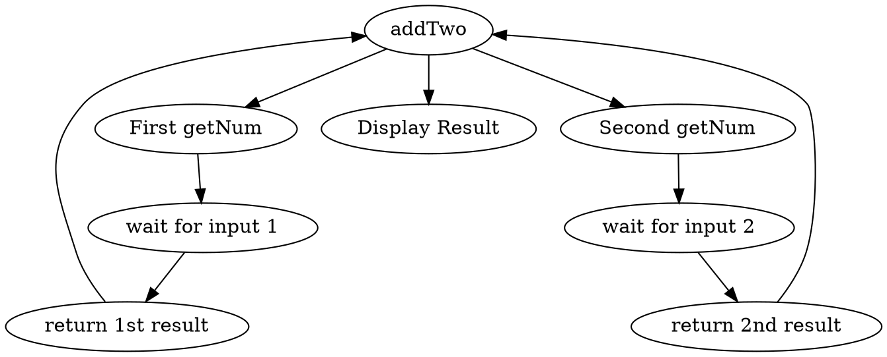
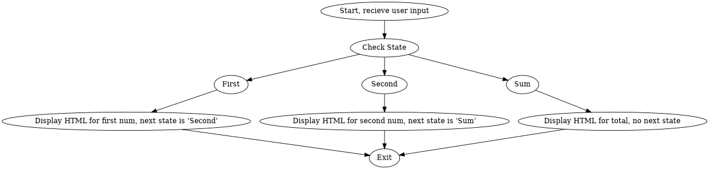

== Do As I Do ==
Lets try a simple method. I'll show you code, then I'll talk about it. Here is our first example... it isn't exactly a hello world but it'll do.

```perl
#!/usr/bin/perl

use strict;
use Continuity;

package Addnums;
use base 'Continuity::Application';

sub main {
  my $self = shift;
  my $a = $self->getNum('Enter first number: ');
  my $b = $self->getNum('Enter second number: ');
  $self->disp("
    Total of $a + $b is: " . ($a + $b) . ".
    So there.
  ");
}

sub getNum {
  my ($self, $msg) = @_;
  my $f = $self->disp(qq{
      $msg <input name="num">
      <input type=submit value="Enter"><br>
  });
  return $f->{'num'};
}

package main;

my $c = new Continuity(
  appname => 'Addnums',
  print_html_header => 1,
  print_form => 1,
);

$c->go();
```

Here we have two modules going, and in fact you may want to split this into two scripts. All this program does is prompt for a first number, then prompt for a second number, and then show the sum. Very boring, but lovely for pointing out some features. Lets go by way of execution-flow.

First, besides doing some declaration stuff, lets look at the Main package. Here we create a new Continuity object, and give it some settings. There is only one manditory parameter, appname. This corresponds to the name of our class, the one which actually holds the application. This one is named Addnums, and you can see its definition above. Addnums doesn't want to worry about printing the standard html header, nor does it want to print out the form tags, so we ask Continuity to take care of these things.

Once we have our Continuity object set up, and have named it $c, we tell it to GO! And that it does.





