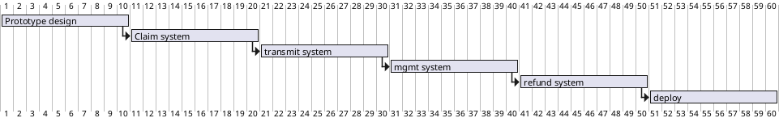
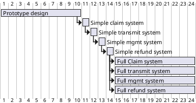

An exploration of mitigating project risks with frequent deploys and prioritizing end-to-end execution.

## Common project risks

Introducing change to a project always comes with some risk. Some examples:

* Breaking existing functionality
* Not building the "right" thing
* Specified wrong
* Implemented wrong
* Not handling data scale
* Difficult deploy
* Difficult rollback
* Difficult to work on (local setup)
* Taking longer than expected to develop
* Developing without value being delivered

Here are two key strategies to help mitigate some of these risks!

## Deploy First

The first thing you should do when working on a project is deploy. Then you know that you can do it with the existing code.

The second thing you should do when working on a project is to write a stub of what you are doing, prove that it doesn't cause a regression (wrap it in a beta-flag if need be), and then deploy.

Here's what usually happens: You wait until the end of the project to deploy. Then you realize that you can't deploy, because you need a new database or because your deploy script doesn't work or because this is a new service that has never been deployed before and you simply don't know how. So you start working on deploying it into a staging environment. But then you have to go around and build a staging environment and get all of your stuff working there. Then you test. But you STILL can't deploy to production, and you don't know how long it will take. So finally you get your prod stuff set up and deploy, 2 weeks after you intended to be done with the project.




Typical way to do that last deploy:
* Get it running on your machine, working pretty well
* Put in a PR
* Help get it running on someone else's machine, working pretty well
* Iterate a bit
* Try to get it running on staging
* Iterate a bit, working with QA or other stakeholders via staging
* Try to get it working on production

This stacks up a severe unknown right at the end.

So let's flip this. Work out how to deploy null code, zero changes, into prod. If there is no real code, there can be no real errors, so you don't need to put it into staging first. Next put it into staging, since you'll need that in the future. Now you know exactly how much labor it will take to get your thing into production - none.

Putting something in prod immediately might seem scary, but really this strategy has the least and most isolated risk. Put your empty code behind a feature flag or if safe and non-contradicting put it on a new page that isn't linked.

## Breadth First

A typical project implements a new workflow, usually with several steps or across a few systems. We take the project and break it into features with each feature feeding data into the next. Then we sort based on the data flow and begin implementing features.

Imagine we were trying to add a new feature to our eCommerce site so that people can submit issues with an order. So here we would say "ok! Let's start by building a Create-Claim UI on our site!". We break that into a few tickets and go to work! Once we have that working pretty well we move on to Transmitting, Processing, etc.

```plantuml
digraph g {
  label="Depth First Example"
  node [shape=box style=filled fillcolor=lightgray]
  claim [label="Claims Processing"]
  create [label="Create claim" fillcolor="#44aa44"]
  transmit [label="Transmit to order system\n(unstarted)" fillcolor="#aa4444"]
  manage [label="Claim Management Tool\n(unstarted)" fillcolor="#8888aa"]
  refund [label="Execute Refund\n(unstarted)" fillcolor="#aa88aa"]

  claim -> create, transmit, manage, refund

  create -> create_steps
  create_steps [
    label = "Claim model\nTemplates\nAdd items\nRemove items\nVerify items\nCheck claim status"
    style="dashed,filled"
    fillcolor="#44aa4488"
  ]
}
```

There are a lot of things we might run into in this workflow:

* Business priorities shift before all is done. Code rots for a while before we get back to it
* The backend needs enough information from the frontend to execute a refund, but we don't know what that might be
* Getting the tools into production adds an API, which turns out requires a new set of permissions that we didn't realize until trying to send things (unit tests missed them)
* Getting validations on orders right takes a long time, leaving little time for a quality execute-refund code

One approach that some people take to help with these issues is complete up-front design. You think out every bit of the thing, every interface and API and variable and column, and work them all out ahead of time. While appealing, this has issues too - namely that when you go to write the code you have some situational awareness that cannot be obtained beforehand.

So let's try another strategy. Let's try to get the end-to-end flow working, breadth-first style, and then go from there.

Stub out all the "useful" work code and get this working end-to-end as the first task. For example, instead of letting the user create a complete claim, ask them for a single item or just hard-wire it to the last-most item available without any user input. Don't validate or handle errors on transmitting or even handle different products - make a hand-built json string to transmit if you can. And so on. Use Deploy First Development techniques to put your completely wrong but harmless code into production (behind a feature-flag or permission).

```plantuml
digraph g {
  label="Breadth First Example"
  node [shape=box style=filled fillcolor=lightgray]
  claim [label="Claims Processing"]
  create [label="Create claim" fillcolor="#44aa44"]
  transmit [label="Transmit to order system" fillcolor="#aa4444"]
  manage [label="Claim Management Tool" fillcolor="#8888aa"]
  refund [label="Execute Refund" fillcolor="#aa88aa"]

  claim -> create, transmit, manage, refund

  create -> create_steps
  create_steps [
    label = "Claim model\nOne hard-coded instance"
    style="dashed,filled"
    fillcolor="#44aa4488"
  ]

  transmit -> transmit_steps
  transmit_steps [
    label = "Hard-coded or .to_json\nPOST to backend\n\nReceive on backend and\nblindly (no verification)\ncreate claim"
    style="dashed,filled"
    fillcolor="#aa444488"
  ]

  manage -> manage_steps
  manage_steps [
    label = "UL list of claims\n\nInput box to refund\na claim by id"
    style="dashed,filled"
    fillcolor="#8888aa88"
  ]

  refund -> refund_steps
  refund_steps [
    label = "Send hard-coded $$\namount to processor\nfor an order"
    style="dashed,filled"
    fillcolor="#aa88aa88"
  ]
}
```

Depending on the complexity of the project, a second breadth-first pass might be a good idea - one that doesn't use any hard-coded values for example. Your goal is to get the project to be minimally-useful. Once the project is minimally-useful, every change after that will make it more-useful!

This also opens the possibility of parallel development.



Once you have the end-to-end flow working, and ideally have some testing methodology worked out (either automated or by-hand), then you can switch into a more depth-first technique. You keep factoring out any hard-coded values until you get the whole project organized and feature-full. If you have been deploying the whole time there are no surprises - it isn't a matter of releasing the project, but instead of granting a wider set of people access to an already-working system.

```plantuml
digraph g {
  label="Breadth First Example"
  node [shape=box style=filled fillcolor=lightgray]
  claim [label="Claims Processing"]
  create [label="Create claim" fillcolor="#44aa44"]
  transmit [label="Transmit to order system" fillcolor="#aa4444"]
  manage [label="Claim Management Tool" fillcolor="#8888aa"]
  refund [label="Execute Refund" fillcolor="#aa88aa"]

  claim -> create, transmit, manage, refund

  create -> create_steps
  create_steps [
    label = "Claim model\nTemplates\nAdd items\nRemove items\nVerify items\nCheck claim status"
    style="dashed,filled"
    fillcolor="#44aa4488"
  ]

  transmit -> transmit_steps
  transmit_steps [
    label = "Serialize claim\nPOST to backend\nReceive on backend\nBackend claim model"
    style="dashed,filled"
    fillcolor="#aa444488"
  ]

  manage -> manage_steps
  manage_steps [
    label = "List of claims\nLook up a claim\nModify a claim\nAdd notes to a claim\nAccept/Reject a claim\nTransmit claim status"
    style="dashed,filled"
    fillcolor="#8888aa88"
  ]

  refund -> refund_steps
  refund_steps [
    label = "Update order\nWrite accounting info\nSubmit to processor\nUpdate claim status"
    style="dashed,filled"
    fillcolor="#aa88aa88"
  ]
}
```

## Notes for article improvement

* Give example of depth-first
  * Why this is natural
  * How it misses important end-to-end questions
  * How it doesn't lock in useful value
  * How it can catch some low-level implementation detail issues early
* Give example of breadth-first
  * Why it is unnatural
  * How it answers important end-to-end questions
  * How it locks in value sooner
  * How it can miss low-level implementation details early
* Come up with another example. Something generic. Blog Engine? Blog admin panel?
* Is this the same as top-down vs bottom-up design/coding?
  * Both breadth-first and depth-first are part of an overall top-down plan
  * Depth-first works fine if you start at the bottom and work your way up, so is compatible with bottom-up, kinda
  * Bottom-up could be considered breadth-first but starting at the leaf-nodes
  * Doesn't lock in useful value
  * I guess you might call this "middle-out" design
* Feedback loops!
  * Breadth first when it comes to team roles - design, dev, qa, ops
* Get end-to-end flow early
  * Try out general and happy-path workflow
  * Discover initial boundaries and APIs
* Breadth-First vs TDD?
  * Maybe breadth-first is more BDD
* First pass only?
  * After end-to-end flow is established, depth on an individual piece can continue to lock in value
  * Once the first pass is done you can more safely parallel-path develop the sub-components
* Psychology of BF-vs-DF
  * https://arpitonline.com/2010/04/10/on-breadth-first-and-depth-first-thinking/ - says that breadth-first is indicative of a happy state of mind and is more conductive to out of the box thinking, and that tension/pressure puts you into depth-first mode.
    * "So concept in breadth first mode, execute in depth first."
  * http://www.dubberly.com/articles/middle-out-design.html - I was joking about calling it middle-out (Silicon Valley reference), and JoshC actually googled it and found this interesting article.

