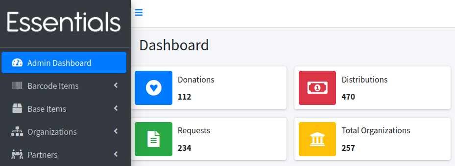

Part of the Ruby For Good organization; inventory control for diaper and period-supply banks.

See the [Human Essentials Github repo](https://github.com/rubyforgood/human_essentials) for the main project itself. I am but one contributor, though I've been working on this project very steadily since 2022 (with some smaller contributions in 2018-2019).

I got turned onto the [Ruby For Good](https://rubyforgood.org/) project in 2018 via the local DC Ruby community (especially Sean). I attended one of the annual events where there were several projects to choose from, but Human Essentials (previously DiaperBase) matched my background in inventory/warehousing very well. I distinctly thought .... "I've never used my powers for GOOD before. Hmm!"

Every week on Sunday morning ("[This Is My Church](https://www.youtube.com/watch?v=bhSB8EEnCAM)") I get together with the team on a Zoom. We triage inbound issues and projects, groom requirements, discuss some technical design or roadmap. Then over the week I spend some small amount of time (always wish it was more) picking up some tickets, reviewing PRs, etc. Lately I've been running the deploys and infrastructure.

Join Us!
