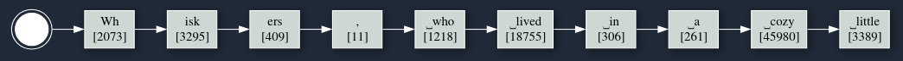

Each token is one choice from many forking paths. Let's see some of the other possibilities. Also try the [Live LLM Token Tree Visualization Tool](https://thelackthereof.org/token-tree/)!

## The Next-Token Machine

Mostly we talk about LLMs (Large Language Models) as generating one **token** (roughly a syllable, it depends) at a time. But that's not really the whole picture. Given the context, all of the text that has led up to this point, the model will rank *all of the possible tokens* and assign each a weight (a probability).

So if you have `"Once upon a time there was a cat named"` as the prompt, the LLM will internally score and rank every word (token) that it knows by how good a next-token it would be. The vast majority of next-tokens are very bad choices, and are scored low. But some of the next-token choices are viable choices, and some are even a bit arbitrary.

Here you can see a list of tokens of what could come after our prompt. First is `Wh`. Once a token is generated it is pretty locked in, so the next `isk` and then `ers` aren't too surprising. The first `Wh` could have been `z` ... but that sort of nonsense token is ranked very low.

But each **step** of the selection doesn't look like this. Instead, at each step the overall execution is *sampling* one of the possible next-tokens.

## Token Vocabulary

People talk about the "length" of a token -- that it is one word or one syllable and so on. But ... how many tokens *are* there?

Each token gets turned into a number, a single integer that represents that particular set of letters or symbols. You may have seen this before with simple A=1, B=2, C=3 type codes. Or with [ASCII](https://en.wikipedia.org/wiki/ASCII) where we also include some control characters. Or with Unicode where there are a bunch of symbols and things -- now we're getting into `token` territory.

Let's look at some example Tokens from GPT-4o:

* `A` = 32
* `B` = 33
* `C` = 34
* `Wh` = 2073; Yes this is a capital-`W` and lower-case-`h`
* `isk` = 3295; Yes this is three letters
* `⎵cozy` = 45980; That is a space followed by `cozy`

A LOT of tokens are bits of sentences with a space in them already, rather than space being a separate token. In the visualizer you can turn on "Show ID" to see the numeric value for each token. Here is an example:

## Sampling

A lot of models have a 32,000 token vocabulary. That is to say, there are 32,000 possible different tokens that could come next after the context. At each step these are fully ranked and weighted -- so the top-ranked might be choice-1, the second-best choice would be choice-2, and so on. Each of the tokens is assigned a weight (a "logprob", or logarithmic probability), and then ranking is basically the sorted list based on this weight.

There are typically two token selection layers. First, most implementations narrow down to the top 40 or so possible tokens. Next they use a "temperature" multiplier and use the weights to randomly pick one of the tokens. If there is only one really-good choice, then the weights will make it so that it is VERY unlikely, if not impossibe, for some worse token to be chosen.

We can see this by running the same prompt over and over again. Each time we run it we'll note each token, and then we'll build out a tree based on how the tokens showed up time after time.

To make this a bit more visible, here we can see the tree with *counts* for how many times a particular path was taken.

We can already learn a lot! For one thing, `Whiskers` appears to be a very common name for our kitten. Though after the name, the story goes on to either have a comma (`,`), or maybe NOT have a comma, and talk about where Whiskers lived.

## Kittens

Out of some curiosity, let's ask GPT-4o to do something similar. We have to change the prompt a little to get it to tell us the story (these public models have a BUNCH of additional context when run interactively).

OK ... now let's try [Claude (from Anthropic)](https://claude.ai)...

Yep. Kittens are named "Whiskers".

Now ... to be scientific about it, really I should run these chat interfaces over and over again to see how statistically likely it is for the kitten to be named Whiskers. Let's do that with the token-tree visualizer. Here I'll have it run 100 times to build the tree.

OK ... out of the 100 executions, 97 of them (!) named the kitten Whiskers. One of them started to tell the story from scratch. And then TWO of them named the kitten Luna!

Therefore all kittens in stories are named Whiskers, or maaaayybbeee Luna. Facts.

In conclusion, play around with this [LLM Token Tree Visualization Tool](https://thelackthereof.org/token-tree/) to form some new intuitions. You can get the source code over at [https://github.com/awwaiid/token-tree](https://github.com/awwaiid/token-tree).
