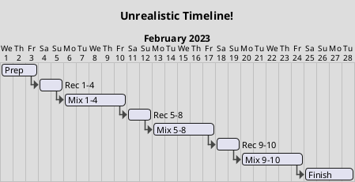

I'm going to try to do the [RPM Challenge](https://www.rpmchallenge.com/) again this year. Millionth try is a charm?

## Previous Attempts

The challenge: 10 tracks or 35 minutes of original music recorded during the month of February.

I'm not really sure how many times I've sat where I am now, a few days before (or a few days after!) February 1st and thought to myself ... LETS DO THIS. But I'll tell you how many times I've gotten through is very easy -- zero!

That's not to say that I haven't had some fun trying. Jason and I, in particular, tacked the challenge a few times and came out with several very fun songs. I think that's where I got [[Code On My Mind]] for example. We'd get together on a Saturday with the idea that we'd jam out like 5 songs and end up with 1 or maaaybe 2. More than most other Saturdays!

## This Year

I of course have things going on. Work. Normal life. We're going to AZ for a week. So the strategy this year is, as always, a bit tricky.

One thing that I've been doing for a while now is to record little tunes that pop into my head on my phone. So I'll be singing to myself "I LOVE MY CHI-HUA-HUA.... LA LA LA" or something and if it has some potential then I'll record it. Try to get the idea, the basic concept, down. Interestingly my first attempt is almost always bad. I get self-consious or something and stumble on words that I might have been dancing along merrily only a moment before. So I sing it into the recording a bunch of times, maybe do some variations.

With that seed, I figure there are two big steps for each song. Step 1, write and record the song. For time sake and for organic composition those are probably MOSTLY the same step. Then Step 2 mix and master the song.

I'm thinking I'll try to put some distance between recording and mixing, though that leaves some risk that as I mix I'll need something re-done or added but I'm no longer set up to do that. But if it works, then maybe what I'll do is record songs on the weekend and then mix songs during the week. If I pace myself it'd be 2-3 songs a week. I'm worried that won't work, that I'll run out of momentum. So! Let's shoot for 3-4 songs per week, or really as many as I can muster up-front.

I'd always like to throw in a collaboration or three, even though that complicates it. One idea is to record with Elizabeth and Nate when I'm in AZ. Another is to get my kid neighbor Theo in to do a drum session with me at 7drumcity. We'll see how those play out.

**2023 LET'S GO!**
