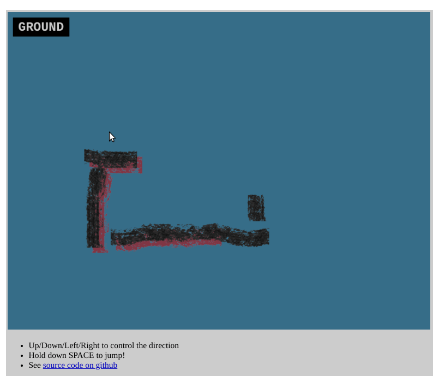

Creating a simple snake game with the help of ChatGPT.

img:paper-snake-pixel-art.jpg _Pixelated snake, possibly in the desert, somewhat two-dimensional. Image by Bing Image Creator._

I was chatting with Mario about a school project he was working on. Essentially, he needed to write a program in Elm (based on a list of lesser-used languages) that exemplified what the language is typically used for. Since Elm is a highly reactive, web-centric language, I suggested creating a game. He chose Snake, a simple and solid option.

For some reason, I began contemplating Snake, specifically considering potential design or game elements that could be added to it. Two ideas came to mind. The first was to render the snake as a flat piece of paper, with each segment possibly being a tiny scrap of paper, and animate it in a style reminiscent of stop-motion animation. The second idea involved the snake "jumping over" or "diving under" its existing segments. I'm sure these ideas have been explored before, but they sounded fun :)

Mario completed his traditional Snake game before I could even share my paper-snake concept with him, so I decided to give it a try myself. I also wanted to practice using TypeScript. After finding a nice [PhaserJS + Typescript + Vite template](https://github.com/ourcade/phaser3-typescript-vite-template) I was off and running!

While experimenting with various technologies, I thought I'd mix in some practice with ChatGPT. I loaded it up and began asking questions about building a Snake game using this stack. Since the Snake game concept is so common and straightforward... I found that ChatGPT had TONS of knowledge about implementing Snake. I prompted it in a few different ways to incorporate my style and game concepts, and I think it saved me hours of research time.

Within one afternoon, I (or should I say, we?) had a working game with the jumping feature and everything! I'm pretty sure ChatGPT could have written almost this whole thing from scratch/memory, btw. But it also followed my direction on naming and organization.

 _GIF demonstrating Paper Snake. Red shadows are when the snake is jumping._

It does not yet look like super cool paper animations, heh.

You can see the [current version of the game](https://awwaiid.github.io/paper-snakes/) and the corresponding [github repo for paper-snakes](https://github.com/awwaiid/paper-snakes).

