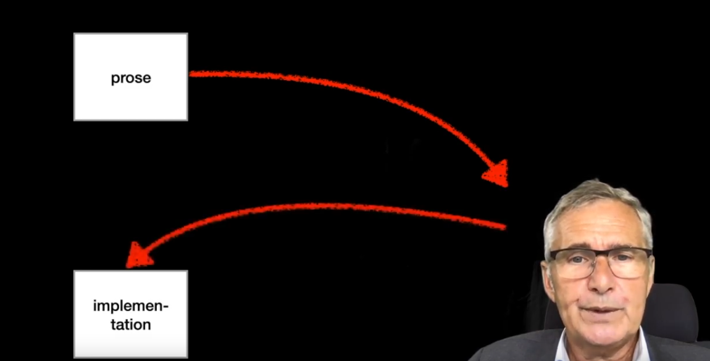
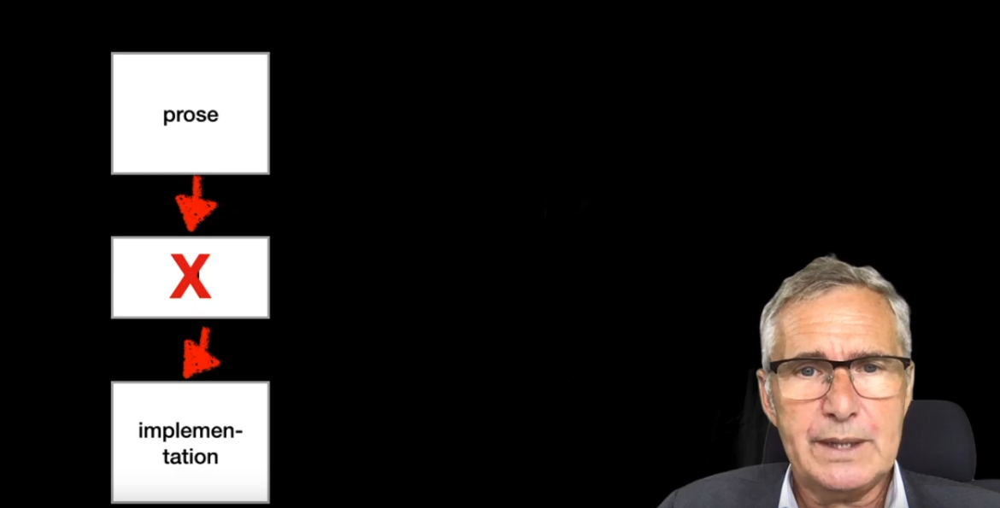
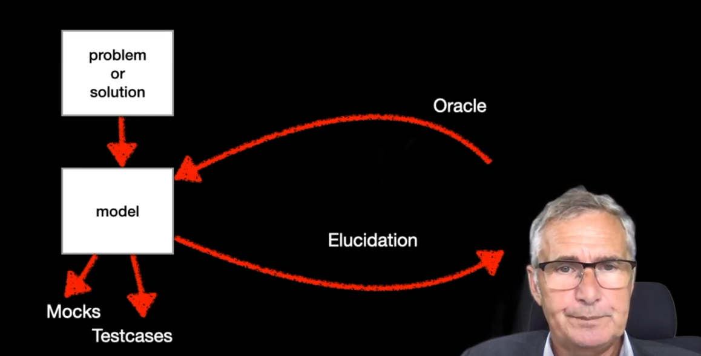

Some notes and thoughts on Peter Kriens' video, as [posted on the Alloy Discourse](https://alloytools.discourse.group/t/the-use-of-alloy-and-llms/449/2)

## Notes and Quotes

Video: [Peter Kriens - Thoughts on Alloy, Formal Models, and Software Engineering (youtube)](https://www.youtube.com/watch?v=_j3SdIGqYG8)

In this talk, Kriens talks about the practicalities of formal modeling, highlights flaws in a focus on correctness, and advocates for models as a way to elucidate our thinking about a problem or system.

> 
> "Although I really enjoy Alloy, there is a wide gap between formal languages and implementation languages and there seems to be no bridge in sight"

Kriens says he often finds himself using Alloy or other tools to initially explore a problem, get a rough model set up to explore the space, and then abandon it quickly and moving to implementation. The "prose" of the initial problem has to be processed by a programmer to get to the implementation, rather than using the formal model further down the development lifecycle.

> "Once we have an implementation, although there have been attempts, as far as I can see that is a long way to go before we can automatically create test from a model"

OK interesting. Challenge accepted.

> 
> "Prose is also not digestable by our computers. Although AI made impressive progress in pattern recognition, understanding prose is as far off as it was in the 1960's, almost 60 years ago. The developers must interpret the prose and translate their understanding to the proper use of the API. The computer is too stupid to provide any help here, except for the formatting maybe."

This talk was from 2020 .... oh how the world has changed in four short years! We now have Large Language Models which can do some *impressive* understanding of prose.

Krien goes on to explore the idea of taking our high-level prose of a problem, the sort of things that we might leave in comments in our code, and replacing it with a very usable version of a formal model to serve as an "Oracle", a probe-able system to ask questions about the specification while building and maintaining the implementation. It could also generate verified test cases and mocks, and generally could provide inconsistencies and validate guarantees in an ongoing way.

Kriens did some experiments with DSL or other tooling to generate target system tests and such. He explored using reflection in the Java type system for expanding/annotating alloy and using it to generate Java. He also highlights some specific data structures and how they'd map from an imagined Alloy++ onto Java objects.

## Ideas
* Build some re-usable alloy for common scripting language data structures -- scalar, array, hash
* Any value in generic "object" as a thing with instances, methods?
* Use Alloy as a straight up way to generate mock data; a deeper version or an enhancement or layer on top of FactoryBot
