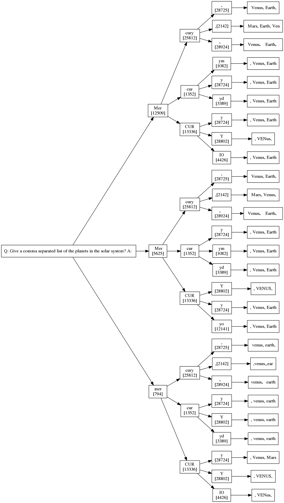

Pairing, learning about LLM KV-caching

## Part I - Morning

* **General Status:**
  * In the hub today
  * I need to work on getting this [Human Essentials Dashboard PR](https://github.com/rubyforgood/human-essentials/pull/3788) mergeable
* **Alloy+LLM+Rails Project:**
  * When I run the out-of-the-box generate locally it generates tokens fast-enough for my tree demo
  * So I'm going to focus on getting the tree generation to be *as fast* as that
  * Because as I think of it, when I shift to whole-codebase analysis it is unlikely that I will do that on anything smaller than a hosted API-based model (GPT-4, Claude2, etc)
  * Dunno

## Part II - Evening

* **General Status:**
* **Nerd Snipe:**
  * Fixed my vim comment-code keybinding. Where did it go before? Also ctrl-backspace to delete-word.
* **Alloy+LLM+Rails Project:**
  * Paired with *O*!
  * He walked me through how some of the LLM KV caching works
  * So now I'm walking through my code to see if I can make it a bit faster
  * I also got progress on displaying a whole tree and a web interface
  * I think next I want to generate the tree incrementally on the web
  * I'll stop at that point though, outputting graphviz is satisfying enough for now

