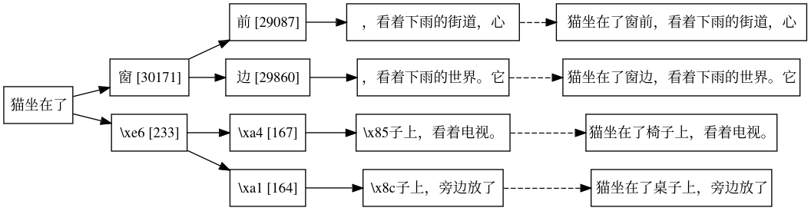

Pairing, unicode tokens, graphviz bling

* **General Status:**
  * Starting to get into the hub-vibe a bit more, love it. Starting to actually remember individuals better! I'm so bad with names, but will keep asking over and over until I get it :)
  * I got to show the token-tree thing to a few individuals and then presented at the big session, very fun
  * Still having wayland/sway + zoom issues :( . Weird color inversion, floating-vs-non-floating-windows, etc. But I'm sticking with it. Hard to switch after like 15 years of xmonad (and like 25 years of X11 heh), but it's at like 99.9% so can't stop now
  * Shout out again to *O* who helped me sort out some caching issues that was slowing down CPU token generation. Making it fast-enough has been really helpful
  * Will be Virtual RC tomorrow (Friday), gotta do some errands and prep for a friend-visit over the weekend
* **Alloy+LLM+Rails Project:**
  * Working on wrapping up token-visualization
  * Paired with *Q*, sorted out some escaping and unicode things
  * Added a bit of bling shadows and scaling (styling SVG with CSS is fun!)
  * Got incremental streaming of updates, background threading of the processing, and interruptability
  * Going to now switch over to Alloy; do some tutorials and toy models, build a few by-hand models of real world apps (Human Essentials Rails)
  * Somewhat of a pure-research project, so I'll go with where it takes me. But I am feeling the time-pressure a bit, and am hungry for artifacts to show off in the end. We'll see what comes next :)

