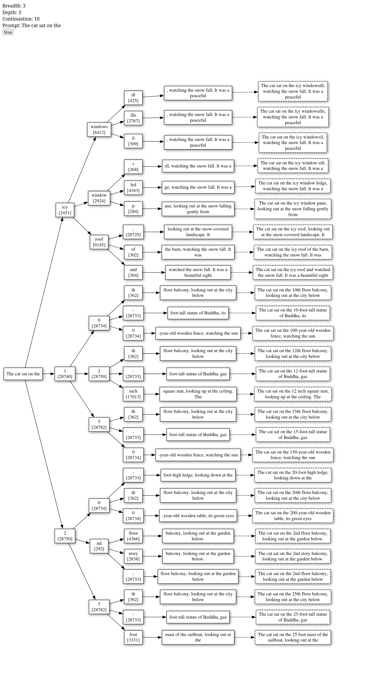

Virtual errands, GPU token generation. Oh right, Alloy

* **General Status:**
  * Virtual today
  * Mostly doing some errands and general reading
  * Hung out with *J* some, looking at LLM stuff and showing a GPU cloud executor
* **Alloy+LLM+Rails Project:**
  * I'm giving local-intel-gpu one more last chance
  * ... I got it working on an A100 and it was a lot faster! But like... 10x, not instant
  * I generated a large tree but it had some unescaped character that I haven't found yet so I don't have the actual rendered graphviz
  * I remembered to turn off the rented instance :)
  * I started going back and updating Alloy knowledge, esp around time-domain which was added since I learned it
  * Next I need to start doing real Alloy models of things I think about or systems I use, and start improving the tooling around that
  * I'm starting to think about Alloy tooling, both direct and LLM; like in addition to Rails in/out I'm thinking of PlantUML in/out. A lot of Alloy users report using it as a *thinking tool*. I use PlantUML as a *thinking tool*. So ...
