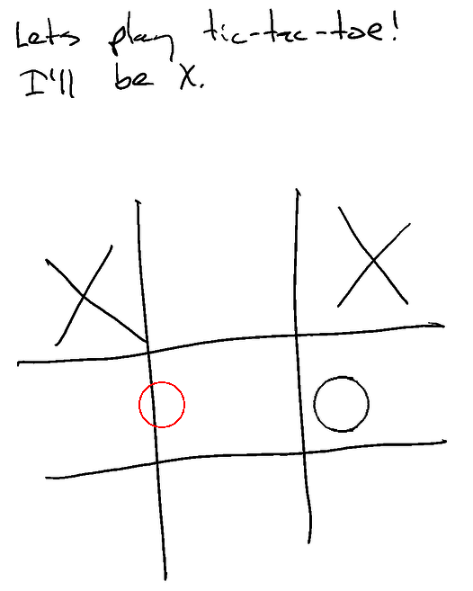

Working on [[Ghostwriter]], making some incremental progress on playing tic-tac-toe.



## It Was Worse Before

I've been trying to play tic-tac-toe with [[Ghostwriter]], but it is quite bad. Reading the LLM transcript, it sees that we are playing, has a good idea of what it wants to do, but can't aim its output very well at all.


Here you can see that Ghostwriter sees that it is `O` and does indeed draw an `O` ... but kinda off the board. This is actually one of the better attempt. I even switch from OpenAI to Anthropic Claude to see if it'd get better, with limited success. Doing some research, it turns out that generally VLMs (Vision LLMs) aren't great at this sort of thing.

## What's Your Plan?

One thing that definitely has helped is including a request for bounding boxes in the prompt.

```json
  "input_description": {
      "type": "string",
      "description": "Description of what was detected in the input image. Include the exact pixel x, y, width, height bounding box coordinates of everything."
  },
  "output_description": {
      "type": "string",
      "description": "Description of what will be drawn. Include the exact pixel x, y, width, height bounding box coordinates of what you want to draw."
  },
```

I'm working on an evaluation framework which might allow fine-tuning this in an incremental way. I'll record the initial screenshot and then run it through a few times to get results. Ultimately I hope to even try using a secondary VLM as a judge and perhaps another as a prompt tuner/generator. Maybe get a little Genetic Algorithm going? hmmm.

So this helped for sure! But everything has still been pretty off.

## How Big Is The Screen?

In fact ... all of the `O`s seemed above the board, to the point where I started to re-read docs. What was happening is that the **Claude API was scaling the image down**, which both contradicted some of the system prompt and made it not know where the board was.

So now I pre-resize to 768x1024 px. Seems a bit small, but the result is already better!


Here you can see I started in the upper-left with `X`. Ghostwriter then went in the middle-right with an `O`, and I moved in the upper-right with an `X`. Finally (in red), Ghostwriter moved sort of on the line. What you don't see here, however, is that even the first `O` was wrong -- in the JSON transcript it was actually targeting the middle box.

But still -- **PROGRESS!**

I'm going to run some hand validation to make sure the input to the VLM is the right size and that I'm scaling the SVG to the screen correctly. After that I will likely go back to doing some pre-processing, adding in segmentation or something to make it easier for the VLM to locate things on the screen.

Unfortunately if you look at a tic-tac-toe board ... it's kinda awkward. Each of the outside 8 cells are technically open, so it's hard to recognize that they are cells at all. The VLM by itself gets it at a high level, but I'm not sure how well it can break it down. But I'm also not sure what sort of segmentation algorithm would do better.

Under all of that, from what I've seen on the internets these LLMs are not actually all that good at actually playing tic-tac-toe or other 2D spacial games (like Chess) in the first place. But that isn't really the problem so far -- the problem right now is that the VLM *wants* to move in the center but can't figure out where the center is.
