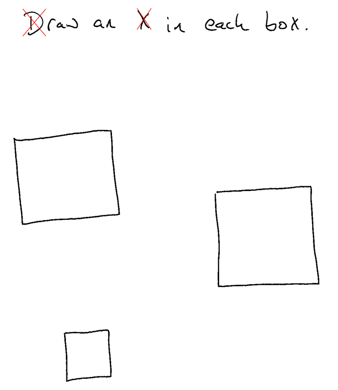

Drawing Xes in Boxes is harder than you might think! Teaching [[Ghostwriter]] a bit about space by pre-segmenting the input image gets us closer.

## The Problem

You may recall from [[TLT - 2024.11.23 - A Ghostly Game]] that [[Ghostwriter]] is ... not good with spatial awareness. For example, we can ask it to draw an X in a box and see how close it gets...


Not great. That is even *after* we tried the "plz think harder" approach, asking the LLM to write out where it thinks things are with bounding boxes and planning where things should go and all that. It still can't hit the box that it can see.

It can _read handwriting_, it _knows there is a box more or less in the middle_. So close!

## Step Outside The Box

> **Vivian Jaffe:** Have you ever transcended space and time?
> **Albert Markovski:** No. Yes. Uh, time not space. No. I have no idea what you're talking about.
> *(I Heart Huckabees, 2004)*

So with a little help from my friend [Cody](https://sourcegraph.com/cody) I whipped up a relatively dumb segmenter. It uses [image](https://docs.rs/image/latest/image/) and [imageproc](https://docs.rs/imageproc/latest/imageproc/) to find contours, snaps boxes around them, and then looks for the big ones. So in the case of our box, here is a bit of extra that we put into the prompt:

```
Here are interesting regions based on an automatic segmentation algorithm. Use
them to help identify the exact location of interesting features.

Region: x=400, y=572, width=640, height=613
Region: x=31, y=32, width=41, height=41
Region: x=811, y=96, width=133, height=127
Region: x=279, y=162, width=83, height=29
Region: x=178, y=128, width=69, height=86
Region: x=1014, y=138, width=43, height=47
Region: x=36, y=37, width=31, height=31
Region: x=979, y=96, width=42, height=85
Region: x=549, y=118, width=56, height=76
Region: x=439, y=149, width=53, height=56
```

And now it gets much closer!


This is a pretty coarse-grained way to give a sense of space, but it is working much better with this segmentation hint. There are a few other things that might work as well -- we could give it an image of what each of the segments has inside of it, we could merge segments with some center-of-gravity sort of thing. Etc.

Let's try more boxes!



Whelp... still more work to do! :)

