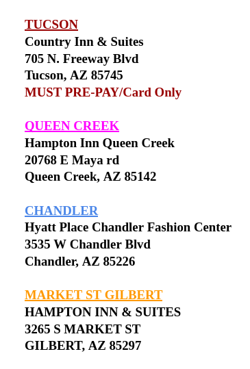
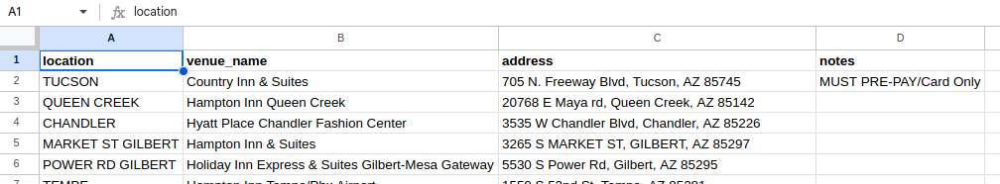

A small data transform / cleanup task using LLM labor.

---

My mom is now running a small business, [$129 Arizona Discount Traffic Survival School](https://129aztss.com/), and I'm tinkering away at a website for her. The other day she gives me a google doc with venue addresses, asking if I can put it up on the site.



While the doc was pretty consistent, it'd be even better as a nice little spreadsheet. In fact, if it is a Google Sheet then you can HTTP GET it as a CSV live! Then if she adds a venue to the sheet it will magically show up on her website.

Alas. This is a Doc not a Sheet. But we live in the future! Grabbing my pre-set-up [llm](https://llm.datasette.io/en/stable/) and [claude.ai](https://claude.ai), I simpy do this:

```sh
cat | llm -s 'turn this into a tsv with location, venue name, address, notes'
```

Then I _copy_ from the docs and _paste_ into my terminal, and out pops a tab-separated list! _copy_ from my terminal and _paste_ into a Google Sheet and PRESTO!



Yes -- I could have piped it into `wl-copy` instead of using my mouse to copy like a caveman. One can only go so far!

