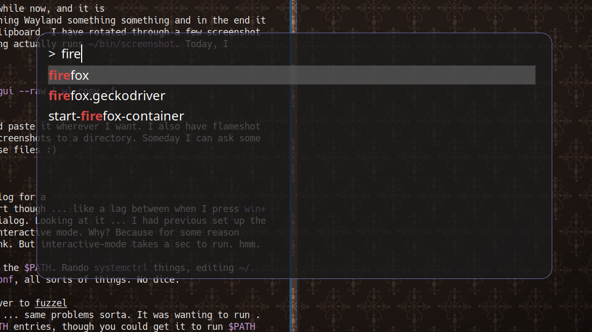

What distracted me today? Flameshot and Rofi.

--

It's a weekend, and on the weekends I am retired. And it has long been my declaration that someday when I retire I will spend all day every day messing with dumb config files. SO!

## Screenshot to Keyboard

I have been using [Flameshot](https://flameshot.org/) for a while now, and it is great! But ... something something Wayland something something and in the end it doesn't copy the image to my clipboard. I have rotated through a few screenshot managers, so my `win+s` keybinding actually runs `~/bin/screenshot`. Today, I modified it to contain:

```sh
QT_QPA_PLATFORM=wayland flameshot gui --raw | wl-copy -f
```

And now I can take a screenshot and paste it wherever I want. I also have Flameshot configured to save _all_ of my screenshots to a directory. Someday I can ask some vision-LLM questions about these files :)

## Faster and Prettier Runner

I've been using [Rofi](https://github.com/davatorium/rofi) as my run-dialog for a while. It is kinda slow to start though ... like a lag between when I press `win+shift+p` and actually get the dialog. Looking at it ... I had previous set up the wrapper script to run zsh in interactive mode. Why? Because for some reason `$PATH` wasn't getting set I think. But interactive-mode takes a sec to run. hmm.

I thrashed all about trying to fix the `$PATH`. Rando `systemctrl` things, editing `~/.config/environment.d/10-path.conf`, all sorts of things. No dice.

Then I spent some time switching over to [fuzzel](https://codeberg.org/dnkl/fuzzel) which seems fast and cool. But ... same problems sorta. It was wanting to run .desktop entries instead of `$PATH` entries, though you could get it to run `$PATH` commands ... but then it didn't add them into the memory list ... etc.

Finally I realized I could go back to Rofi and since I have this wrapper script just throw my `$PATH` export in there! UGLY!!! But it works.

Then I spent a while updating the theme for Rofi to take some inspiration from what I saw over in Fuzzel. Now it looks like this:



Pretty snazzy!!!
