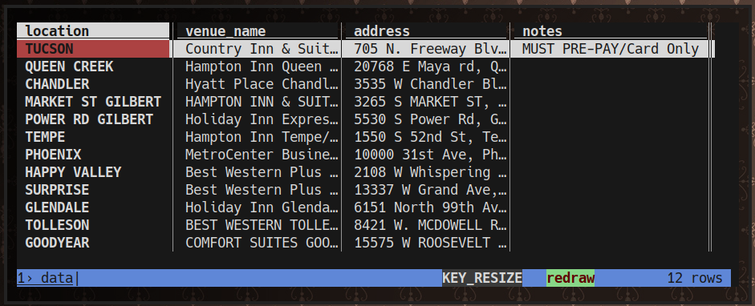

Figured out how to make opening a CSV in firefox pop open a terminal running VisiData (vd)

## VisiData!

I like [VisiData](https://www.visidata.org/)! If you are working with tabular data, like a CSV file, it is a lovely slicer and dicer. It's a pretty terminal-keyboard-heavy program, like a vim family thing. Like many of these power tools, I find that you can get into it best by finding ONE use-case and then gradually introducing new tricks from there. So the simple use-case for VisiData is simply viewing CSV files.



After that you can learn some new commands, such as selecting rows with `|gilbert` (regex select rows containing "gilbert") and then zooming in on them with `"` (view only selected rows). You can press `<enter>` on a row to see it vertically.

After a while you get addicted to this sort of manipulation and you find yourself downloading CSVs from Firefox and then opening a terminal, navigating over to your downloads folder, and opening it with `vd data.csv` or whatnot. So I wanted to cut out the middle bits.

## XDG, Terminal Wrapping

First make a .desktop file for visidata at ~/.local/share/applications/VisiData.desktop containing:

```
[Desktop Entry]
Encoding=UTF-8
Version=1.0
Type=Application
Terminal=true
Exec=vd %U
MimeType=application/vnd.oasis.opendocument.spreadsheet;application/vnd.oasis.opendocument.spreadsheet-template;application/vnd.sun.xml.calc;application/vnd.sun.xml.calc.template;application/msexcel;application/vnd.ms-excel;application/vnd.openxmlformats-officedocument.spreadsheetml.sheet;application/vnd.ms-excel.sheet.macroEnabled.12;application/vnd.openxmlformats-officedocument.spreadsheetml.template;application/vnd.ms-excel.template.macroEnabled.12;application/vnd.ms-excel.sheet.binary.macroEnabled.12;text/csv;application/x-dbf;text/spreadsheet;application/csv;application/excel;application/tab-separated-values;application/vnd.lotus-1-2-3;application/vnd.oasis.opendocument.chart;application/vnd.oasis.opendocument.chart-template;application/x-dbase;application/x-dos_ms_excel;application/x-excel;application/x-msexcel;application/x-ms-excel;application/x-quattropro;application/x-123;text/comma-separated-values;text/tab-separated-values;text/x-comma-separated-values;text/x-csv;application/vnd.oasis.opendocument.spreadsheet-flat-xml;application/vnd.ms-works;application/clarisworks;application/x-iwork-numbers-sffnumbers;application/x-starcalc;
Name=VisiData
```

which I got from [this fun page](https://dev.to/ajkerrigan/today-i-learned-opening-csvs-with-visidata-in-tmux-from-the-firefox-flatpak-app-4m07) with some slight modification.

This worked! But it opens in gnome-terminal instead of alacritty. After some digging I found from [this merge request](https://gitlab.gnome.org/GNOME/glib/-/merge_requests/2839) that you can put a wrapper named `xdg-terminal-exec` in your path and it'll use that as the priority terminal app. So I created ~/bin/xdg-terminal-exec containing:

```sh
#!/bin/sh

exec ~/bin/terminal -e "$@"
```

And that in turn calls my per-machine terminal script, which contains roughly:

```sh
#!/bin/sh

if [ "$HOSTNAME" == "arcanejill.thelackthereof.org" ]; then
  exec aterm -rv -tr -sl 10000 -sh 50 -ls +sb -vb -fn 6x12 -e "$@"
elif [ "$HOSTNAME" == "feline.thelackthereof.org" ]; then
  exec aterm -tr -sl 10000 -sh 50 -ls +sb -vb -fn '-b&h-lucidatypewriter-bold-r-normal-*-13-*-*-*-m-*-iso10646-1' -e "$@"

# ... and so on for various machines I've had that I wanted different settings on

else
  exec ~/.cargo/bin/alacritty "$@"
fi
```

... and now when I click on the CSV from my downloads dropdown in firefox POP goes a terminal running VisiData!

