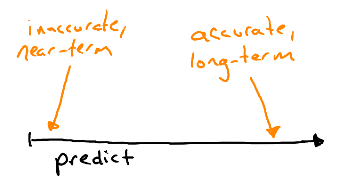
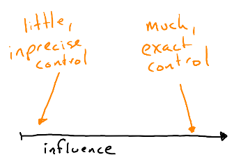
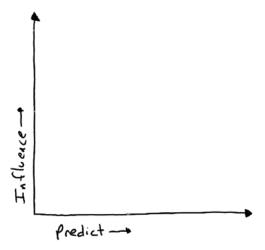
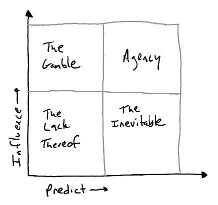

**Agency** (a more useful concept of Free Will), has two important ingredients -- the ability to ***predict*** outcomes and the ability to ***influence*** outcomes -- both of which come in a spectrum of possible degrees. We can lay these out into a visualization that breaks down naturally into a four-square grid.

---

## The Two Ingredients

Lately there has been a lot of thrash in the AI world around `Agents`, like what one is or what differentiates an Agent from an Algorithm and things like that. Let's take this from another angle, and talk through a concept of **Agency**.

<small><i>(Note that there is nothing new under the sun; my thoughts here are largely (probably incorrect and mis-remembered) inspirations from Daniel Dennett and others. I struggle with knowing how to cite these ideas that have been rolling round my head for a long time.)</i></small>

### Prediction

Given the state of the world, how far out and how accurately can you predict what comes next? Drop an apple from shoulder height and you can work out pretty accurately how long it'll take to hit the ground. Flip a coin and you can get it right .... half the time. Guessing what the weather will be in 5 minutes is quite a bit different from 5 hours or 5 years.

{style="width: 100%"}

Your ability to predict outcomes, to predict the future, varies based on the thing being predicted and how good your model is of the world. It gets more complicated when there are other Agents around changing things, but even without that some things are harder to predict and some things are easier to predict. You can also, at the very least, narrow down the range of possible or probable outcomes.

**Prediction is a context-specific spectrum**

### Influence

You have some control, some influence, over the world around you. Generally you can move about, interact with things, push buttons and open doors, etc. The result is that you are changing the state of the world, or possibly even preserving the state of the world. Typing on a keyboard, talking to other people, shouting on a street corner -- these all count too, and can have an outsized effect. Sticks and stones may break my bones, but words can build an army.

{style="width: 100%"}

Making changes to the world, similar to prediction, varies on magnitude and accuracy. This includes how much control we have over our own bodies -- I can stand on a skateboard but I can't do a flip from a half-pipe. I can hold a knife, but I can't use it to repair a heart. The current state of the world also locks down what changes are available -- the heart surgeon can't operate if the patient isn't physically accessible to them.

**Influence is a context-specific spectrum**

## The Four Squares

Put simply -- the amount of **Agency** you have is built on the degree of **Prediction** and the degree of **Influence**. Neither ingredient is all-or-nothing, and Agency itself is not all-or-nothing. Let's lay this out into a diagram:

{style="width: 100%"}

Along the bottom axis we plot the ability to **Predict** outcomes. On the left you have zero ability to predict what-comes-next, and as you move to the right your predictive powers increase in both accuracy and distance into the future.

Along the left axis we plot **Influence**. At the bottom you have zero ability to influence (change) the world, and as you move up your influence increases. A small action might make for a big change, and this axis is meant to capture the magnitude of the resulting change.

Thinking about this in a two-dimensional space gives us some idea of a feedback loop on a fundamental concept -- to have **meaningful Agency** you need to not only be able to influence the world, but have an idea about how that influence is going to actually impact things.

We can break this space into four quadrants and label each of them to get some intuition on the combination between Prediction and Influence.

{style="width: 100%"}

Starting in the upper-left quadrant, ***Low Prediction, High Influence -- The Gamble***. Here you are able to perform an action, make a change to the world, but really have no idea what is going to happen. It is like being on a game-show and you can pick a door, any door, but you don't know what is behind the door.

Jumping down to the lower-right quadrant, ***High Prediction, Low Influence -- The Inevitable***. Being on the high-end of the prediction range, you have a VERY good idea about what is going to happen. But very little of what you do will have any influence on the world, on the outcome. This is the fatalistic and inevitable end that is well known in advance.

Moving to the left bottom, we have ***Low Prediction, Low Influence -- The Lack Thereof***. Here you have no control and no idea what is going to happen. This might be some form of transcendent peace, an acceptance and simplistic state of being. It could also be that you are a pet rock with googly eyes. This is pretty much the opposite of having a lot of Agency.

Finally, in the upper-right, we find ***High Prediction, High Influence -- Agency***. This is a meaningful and useful idea of Agency. You both have the ability to influence the world **AND** a good idea of the outcomes from that influence. Here is where you can **"Call your shots"**, performing some action and having a good idea about the result.

From this basic framework, which we can probe in various ways to build more intuitions, we can derive a lot of interesting questions and conclusions. Chief among them -- if Agency is built on two variable ingredients, and we can change these variables, then ***we can change our degree of Agency***.

I will leave you with that thought :)

