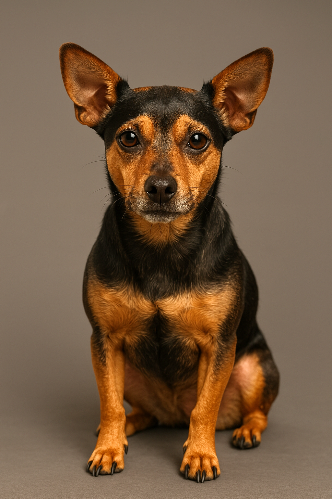

Using the [new ChatGPT GPT-4o Image Generation](https://openai.com/index/introducing-4o-image-generation/) to incrementally generate a photo of Hoda! (A "Chipin" is a 50-50 Chuhuahua and Mini-Pincer. Hoda is 70-20, so is a ChuhuaPin!)

---

Previously if you asked ChatGPT to generate you an image it would switch over to DALL-E, a separate image generation model. Each time it generated a new image it would more or less start from the beginning, maybe, and it was a challenge to get small incremental changes to an image.

With [ChatGPT GPT-4o Image Generation Update](https://openai.com/index/introducing-4o-image-generation/) it now uses the _same model_ to generate the image as it is contextualizing your prompt, which makes it much more capable of things like incremental changes (it isn't starting from scratch each time). At least, that's how I understand it.

As a fun experiment, I tried to generate a dog that looks like hoda! Here is every step that I took. I had to brighten/sharpen the images quite a bit.

<table>
<tr>
<td style="vertical-align: middle;">Create an image of a dog that is 70% Chihuahua, 20% mini pincer, and 10% mutt</td>
<td></td>
</tr>
<tr>
<td style="vertical-align: middle;">Give it a slightly brindle coloring. Still with a black base coat, but the brindle highlights closer to grey</td>
<td></td>
</tr>
<tr>
<td style="vertical-align: middle;">Close, but went a bit too far. Make one halfway between these two!</td>
<td></td>
</tr>
<tr>
<td style="vertical-align: middle;">More black. Also give her a blue harness</td>
<td></td>
</tr>
<tr>
<td style="vertical-align: middle;">Make her a liiiitle thinner</td>
<td></td>
</tr>
<tr>
<td style="vertical-align: middle;">The body and color are good. Make the head a little more chihuahua</td>
<td></td>
</tr>
<tr>
<td style="vertical-align: middle;">Make her hair on her neck a little bald</td>
<td></td>
</tr>
<tr>
<td style="vertical-align: middle;">Really close! Make her ears just a little bit smaller.</td>
<td></td>
</tr>
</table>

This is a lot like what I imagine working with a crime sketch artist would be like! Here is the final image a bit bigger. I think this is what Hoda looked like when she was young!

And here is Hoda from a real camera IRL. A bit older, a bit blinder :)

