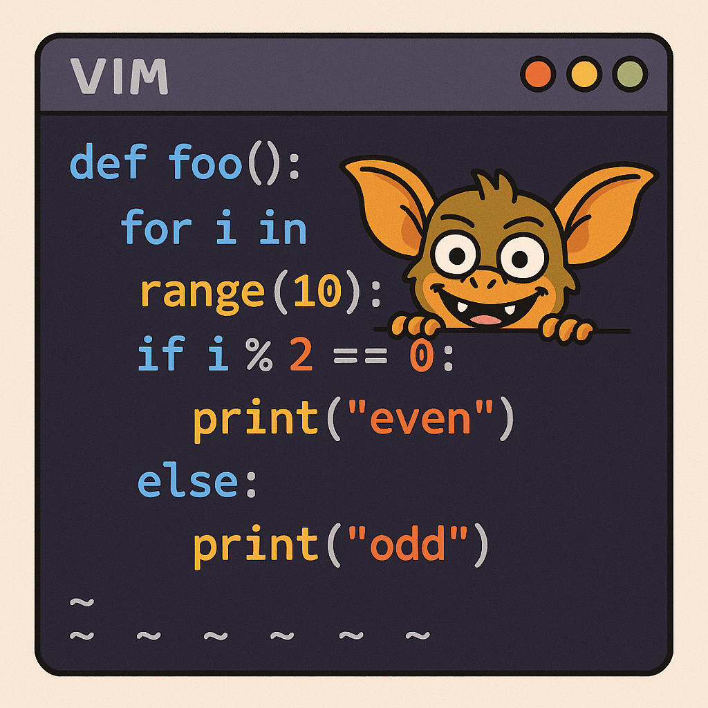

A project which puts LLM-powered gremlins right into your runtime!



As previously mentioned, I enjoy trying out new tech like claude-code, making esoteric and ill-advised libraries that are maybe-jokes, pushing on meta-models and run-time `eval`, and like many others I don't mind 5 minutes of fame. So by that measure, TOTAL SUCCESS!

Let's start with what this new `Gremllm` library that I made can do:

```python
from gremllm import Gremllm

counter = Gremllm('counter')
counter.value = 0
counter.increment()
counter.increment(5)
counter.add_seventeen()
print(counter.current_value)
print(counter.value_in_hex)
counter.reset()
```

To be clear -- each of those methods is completely made up. At runtime when you invoke a method it is _at that moment_ sent over to the LLM (ChatGPT in this case) to generate the python code, which is then executed. It's like claude-code, but at runtime!

Speaking of which, I built Gremllm _using_ Claude Code, which I've been using a lot lately. I'm not always convinced that it is faster, and I'm not always convinced that it is slower, but it is fun enough that I am making stuff that I might not make otherwise at the very least.

Using Claude Code did have some trickery. The biggest thing is that it kept wanting to run my `eval` (or in Python it is actually `exec`) in some sort of sandbox, and I had to be like "no... please do this dangerous thing. Really!". Even now it is doing some things that are more safe than I would have done if it was completely written by hand.

