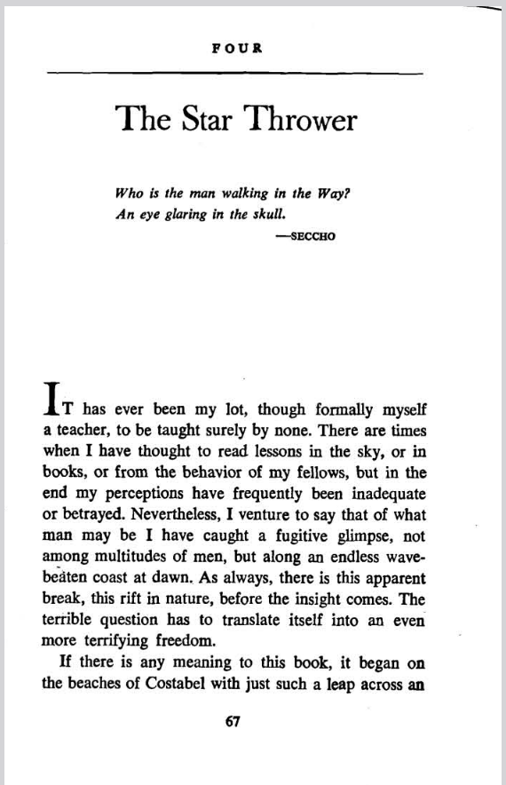

**Editor Note: This piece is by [Loren Eiseley](https://en.wikipedia.org/wiki/The_Star_Thrower), 1969. Published in _The Unexpected Universe_. Transcribed here from a PDF scan I found.**

---

> Who is the man walking in the Way?
> An eye glaring in the skull.
>
> -SECCHO

It has ever been my lot, though formally myself a teacher, to be taught surely by none. There are times when I have thought to read lessons in the sky, or in books, or from the behavior of my fellows, but in the end my perceptions have frequently been inadequate or betrayed. Nevertheless, I venture to say that of what man may be I have caught a fugitive glimpse, not among multitudes of men, but along an endless wave-beaten coast at dawn. As always, there is this apparent break, this rift in nature, before the insight comes. The terrible question has to translate itself into an even more terrifying freedom.

If there is any meaning to this book, it began on the beaches of Costabel with just such a leap across an unknown abyss. It began, if I may borrow the expression from a Buddhist sage, with the skull and the eye. I was the skull. I was the inhumanly stripped skeleton without voice, without hope, wandering alone upon the shores of the world. I was devoid of pity, because pity implies hope. There was, in this desiccated skull, only an eye like a pharos light, a beacon, a search beam revolving endlessly in sunless noonday or black night. Ideas like swarms of insects rose to the beam, but the light consumed them. Upon that shore meaning had ceased. There were only the dead skull and the revolving eye. With such an eye, some have said, science looks upon the world. I do not know. I know only that I was the skull of emptiness and the endlessly revolving light without pity.

Once, in a dingy restaurant in the town, I had heard a woman say: "My father reads a goose bone for the weather." A modern primitive, I had thought, a diviner, using a method older than Stonehenge, as old as the arctic forests.

"And where does he do that?" the woman's companion had asked amusedly.

"In Costabel," she answered complacently, "in Costabel." The voice came back and buzzed faintly for a moment in the dark under the revolving eye. It did not make sense, but nothing in Costabel made sense. Perhaps that was why I had finally found myself in Costabel. Perhaps all men are destined at some time to arrive there as I did.

I had come by quite ordinary means, but I was still the skull with the eye. I concealed myself beneath a fisherman's cap and sunglasses, so that I looked like everyone else on the beach. This is the way things are managed in Costabel. It is on the shore that the revolving eye begins its beam and the whispers rise in the empty darkness of the skull.

The beaches of Costabel are littered with the debris of life. Shells are cast up in windrows; a hermit crab, fumbling for a new home in the depths, is tossed naked ashore, where the waiting gulls cut him to pieces. Along the strip of wet sand that marks the ebbing and flowing of the tide death walks hugely and in many forms. Even the torn fragments of green sponge yield bits of scrambling life striving to return to the great mother that has nourished and protected them.

In the end the sea rejects its offspring. They cannot fight their way home through the surf which casts them repeatedly back upon the shore. The tiny breathing pores of starfish are stuffed with sand. The rising sun shrivels the mucilaginous bodies of the unprotected. The seabeach and its endless war are soundless. Nothing screams but the gulls.

In the night, particularly in the tourist season, or during great storms, one can observe another vulturine activity. One can see, in the hour before dawn on the ebb tide, electric torches bobbing like fireflies along the beach. It is the sign of the professional shellers seeking to outrun and anticipate their less aggressive neighbors. A kind of greedy madness sweeps over the competing collectors. After a storm one can see them hurrying along with bundles of gathered starfish, or, toppling and overburdened, clutching bags of living shells whose hidden occupants will be slowly cooked and dissolved in the outdoor kettles provided by the resort hotels for the cleaning of specimens. Following one such episode I met the star thrower.

As soon as the ebb was flowing, as soon as I could make out in my sleeplessness the flashlights on the beach, I arose and dressed in the dark. As I came down the steps to the shore I could hear the deeper rumble of the surf. A gaping hole filled with churning sand had cut sharply into the breakwater. Flying sand as light as powder coated every exposed object like snow. I made my way around the altered edges of the cove and proceeded on my morning walk up the shore. Now and then a stooping figure moved in the gloom or a rain squall swept past me with light pattering steps. There was a faint sense of coming light somewhere behind me in the east.

Soon I began to make out objects, upended timbers, conch shells, sea wrack wrenched from the far-out kelp forests. A pink-clawed crab encased in a green cup of sponge lay sprawling where the waves had tossed him. Long-limbed starfish were strewn everywhere, as though the night sky had showered down. I paused once briefly. A small octopus, its beautiful dark-lensed eyes bleared with sand, gazed up at me from a ragged bundle of tentacles. I hesitated, and touched it briefly with my foot. It was dead. I paced on once more before the spreading whitecaps of the surf.

The shore grew steeper, the sound of the sea heavier and more menacing, as I rounded a bluff into the full blast of the offshore wind. I was away from the shellers now and strode more rapidly over the wet sand that effaced my footprints. Around the next point there might be a refuge from the wind. The sun behind me was pressing upward at the horizon's rim -- an ominous red glare amidst the tumbling blackness of the clouds. Ahead of me, over the projecting point, a gigantic rainbow of incredible perfection had sprung shimmering into existence. Somewhere toward its foot I discerned a human figure standing, as it seemed to me, within the rainbow, though unconscious of his position. He was gazing fixedly at something in the sand.

Eventually he stooped and flung the object beyond the breaking surf. I labored toward him over a half mile of uncertain footing. By the time I reached him the rainbow had receded ahead of us, but something of its color still ran hastily in many changing lights across his features. He was starting to kneel again.

In a pool of sand and silt a starfish had thrust its arms up stiffly and was holding its body away from the stifling mud.

"It's still alive," I ventured.

"Yes," he said, and with a quick yet gentle movement he picked up the star and spun it over my head and far out into the sea. It sank in a burst of spume, and the waters roared once more.

"It may live," he said, "if the offshore pull is strong enough." He spoke gently, and across his bronzed worn face the light still came and went in subtly altering colors.

"There are not many come this far," I said, groping in a sudden embarrassment for words. "Do you collect?"

"Only like this," he said softly, gesturing amidst the wreckage of the shore. "And only for the living." He stooped again, oblivious of my curiosity, and skipped another star neatly across the water.

"The stars," he said, "throw well. One can help them."

He looked full at me with a faint question kindling in his eyes, which seemed to take on the far depths of the sea.

"I do not collect," I said uncomfortably, the wind beating at my garments. "Neither the living nor the dead. I gave it up a long time ago. Death is the only successful collector." I could feel the full night blackness in my skull and the terrible eye resuming its indifferent journey. I nodded and walked away, leaving him there upon the dune with that great rainbow ranging up the sky behind him.

I turned as I neared a bend in the coast and saw him toss another star, skimming it skillfully far out over the ravening and tumultuous water. For a moment, in the changing light, the sower appeared magnified, as though casting larger stars upon some greater sea. He had, at any rate, the posture of a god.

But again the eye, the cold world-shriveling eye, began its inevitable circling in my skull. He is a man, I considered sharply, bringing my thought to rest. The star thrower is a man, and death is running more fleet than he along every seabeach in the world.

I adjusted the dark lens of my glasses and, thus disguised, I paced slowly back by the starfish gatherers, past the shell collectors, with their vulgar little spades and the stick-length shelling pincers that eased their elderly backs while they snatched at treasures in the sand. I chose to look full at the steaming kettles in which beautiful voiceless things were being boiled alive. Behind my sunglasses a kind of litany began and refused to die down. "As I came through the desert thus it was, as I came through the desert."

In the darkness of my room I lay quiet with the sunglasses removed, but the eye turned and turned. In the desert, an old monk had once advised a traveler, the voices of God and the Devil are scarcely distinguishable. Costabel was a desert. I lay quiet, but my restless hand at the bedside fingered the edge of an invisible abyss. "Certain coasts," the remark of a perceptive writer came back to me, "are set apart for shipwreck." With unerring persistence I had made my way thither.

## 2

There is a difference in our human outlook, depending on whether we have been born upon level plains, where one step reasonably leads to another, or whether, by contrast, we have spent our lives amidst glacial crevasses and precipitous descents. In the case of the mountaineer, one step does not always lead rationally to another save by a desperate leap over a chasm or by an even more hesitant tiptoeing across precarious snow bridges.

Something about these opposed landscapes has its analogue in the mind of man. Our prehistoric life, one might say, began amidst enforested gloom with the abandonment of the protected instinctive life of nature. We sought, instead, an adventurous existence amidst the crater lands and ice fields of self-generated ideas. Clambering onward, we have slowly made our way out of a maze of isolated peaks into the level plains of science. Here, one step seems definitely to succeed another, the universe appears to take on an imposed order, and the illusions through which mankind has painfully made its way for many centuries have given place to the enormous vistas of past and future time. The encrusted eye in the stone speaks to us of undeviating sunlight; the calculated elliptic of Halley's comet no longer forecasts world disaster. The planet plunges on through a chill void of star years, and there is little or nothing that remains unmeasured.

Nothing, that is, but the mind of man. Since boyhood I had been traveling across the endless co-ordinated realms of science, just as, in the body, I was a plains dweller, accustomed to plodding through distances unbroken by precipices. Now that I come to look back, there was one contingent aspect of that landscape I inhabited whose significance, at the time, escaped me. "Twisters," we called them locally. They were a species of cyclonic, bouncing air funnel that could suddenly loom out of nowhere, crumpling windmills or slashing with devastating fury through country towns. Sometimes, by modest contrast, more harmless varieties known as dust devils might pursue one in a gentle spinning dance for miles. One could see them hesitantly stalking across the alkali flats on a hot day, debating, perhaps, in their tall, rotating columns, whether to ascend and assume more formidable shapes. They were the trickster part of an otherwise pedestrian landscape.

Infrequent though the visitations of these malign creations of the air might be, all prudent homesteaders in those parts had provided themselves with cyclone cellars. In the careless neighborhood in which I grew up, however, we contented ourselves with the queer yarns of cyclonic folklore and the vagaries of weather prophecy. As a boy, aroused by these tales and cherishing a subterranean fondness for caves, I once attempted to dig a storm cellar. Like most such projects this one was never completed. The trickster element in nature, I realize now, had so buffeted my parents that they stoically rejected planning. Unconsciously, they had arrived at the philosophy that foresight merely invited the attention of some baleful intelligence that despised and persecuted the calculating planner. It was not until many years later that I came to realize that a kind of maleficent primordial power persists in the mind as well as in the wandering dust storms of the exterior world.

A hidden dualism that has haunted man since antiquity runs across his religious conceptions as the conflict between good and evil. It persists in the modern world of science under other guises. It becomes chaos versus form or antichaos. Form, since the rise of the evolutionary philosophy, has itself taken on an illusory quality. Our apparent shapes no longer have the stability of a single divine fiat. Instead, they waver and dissolve into the unexpected. We gaze backward into a contracting cone of life until words leave us and all we know is dissolved into the simple circuits of a reptilian brain. Finally, sentience subsides into an animalcule.

Or we revolt and refuse to look deeper, but the void remains. We are rag dolls made out of many ages and skins, changelings who have slept in wood nests or hissed in the uncouth guise of waddling amphibians. We have played such roles for infinitely longer ages than we have been men. Our identity is a dream. We are process, not reality, for reality is an illusion of the daylight -- the light of our particular day. In a fortnight, as aeons are measured, we may lie silent in a bed of stone, or, as has happened in the past, be figured in another guise. Two forces struggle perpetually in our bodies: Yam, the old sea dragon of the original Biblical darkness, and, arrayed against him, some wisp of dancing light that would have us linger, wistful, in our human form. "Tarry thou, till I come again" -- an old legend survives among us of the admonition given by Jesus to the Wandering Jew. The words are applicable to all of us. Deep-hidden in the human psyche there is a similar injunction no longer having to do with the longevity of the body but, rather, a plea to wait upon some transcendent lesson preparing in the mind itself.

Yet the facts we face seem terrifyingly arrayed against us. It is as if at our backs, masked and demonic, moved the trickster as I have seen his role performed among the remnant of a savage people long ago. It was that of the jokester present at the most devout of ceremonies. This creature never laughed; he never made a sound. Painted in black, he followed silently behind the officiating priest, mimicking, with the added flourish of a little whip, the gestures of the devout one. His timed and stylized posturings conveyed a derision infinitely more formidable than actual laughter.

In modern terms, the dance of contingency, of the indeterminable, outwits us all. The approaching, fateful whirlwind on the plain had mercifully passed me by in youth. In the moment when I had witnessed that fireside performance I knew with surety that primitive man had lived with a dark message. He had acquiesced in the admission into his village of a cosmic messenger. Perhaps the primitives were wiser in the ways of the trickster universe than ourselves; perhaps they knew, as we do not, how to ground or make endurable the lightning.

At all events, I had learned, as I watched that half-understood drama by the leaping fire, why man, even modern man, reads goose bones for the weather of his soul. Afterward I had gone out, a troubled unbeliever, into the night. There was a shadow I could not henceforth shake off, which I knew was posturing and would always posture behind me. That mocking shadow looms over me as I write. It scrawls with a derisive pen and an exaggerated flourish. I know instinctively it will be present to caricature the solemnities of my deathbed. In a quarter of a century it has never spoken.

Black magic, the magic of the primeval chaos, blots out or transmogrifies the true form of things. At the stroke of twelve the princess must flee the banquet or risk discovery in the rags of a kitchen wench; coach reverts to pumpkin. Instability lies at the heart of the world. With uncanny foresight folklore has long toyed symbolically with what the nineteenth century was to proclaim a reality, namely, that form is an illusion of the time dimension, that the magic flight of the pursued hero or heroine through frogskin and wolf coat has been, and will continue to be, the flight of all men.

Goethe's genius sensed, well before the publication of the Origin of Species, the thesis and antithesis that epitomize the eternal struggle of the immediate species against its dissolution into something other: in modern terms, fish into reptile, ape into man. The power to change is both creative and destructive -- a sinister gift, which, unrestricted, leads onward toward the formless and inchoate void of the possible. This force can only be counterbalanced by an equal impulse toward specificity. Form, once arisen, clings to its identity. Each species and each individual holds tenaciously to its present nature. Each strives to contain the creative and abolishing maelstrom that pours unseen through the generations. The past vanishes; the present momentarily persists; the future is potential only. In this specious present of the real, life struggles to maintain every manifestation, every individuality, that exists. In the end, life always fails, but the amorphous hurrying stream is held and diverted into new organic vessels in which form persists, though the form may not be that of yesterday.

The evolutionists, piercing beneath the show of momentary stability, discovered, hidden in rudimentary organs, the discarded rubbish of the past. They detected the reptile under the lifted feathers of the bird, the lost terrestrial limbs dwindling beneath the blubber of the giant cetaceans. They saw life rushing outward from an unknown center, just as today the astronomer senses the galaxies fleeing into the infinity of darkness. As the spinning galactic clouds hurl stars and worlds across the night, so life, equally impelled by the centrifugal powers lurking in the germ cell, scatters the splintered radiance of consciousness and sends it prowling and contending through the thickets of the world.

All this devious, tattered way was exposed to the ceaselessly turning eye within the skull that lay hidden upon the bed in Costabel. Slowly that eye grew conscious of another eye that searched it with equal penetration from the shadows of the room. It may have been a projection from the mind within the skull, but the eye was, nevertheless, exteriorized and haunting. It began as something glaucous and blind beneath a web of clinging algae. It altered suddenly and became the sand-smeared eye of the dead cephalopod I had encountered upon the beach. The transformations became more rapid with the concentration of my attention, and they became more formidable. There was the beaten, bloodshot eye of an animal from somewhere within my childhood experience. Finally, there was an eye that seemed torn from a photograph, but that looked through me as though it had already raced in vision up to the steep edge of nothingness and absorbed whatever terror lay in that abyss. I sank back again upon my cot and buried my head in the pillow. I knew the eye and the circumstance and the question. It was my mother. She was long dead, and the way backward was lost.

## 3

Now it may be asked, upon the coasts that invite shipwreck, why the ships should come, just as we may ask the man who pursues knowledge why he should be left with a revolving search beam in the head whose light falls only upon disaster or the flotsam of the shore. There is an answer, but its way is not across the level plains of science, for the science of remote abysses no longer shelters man. Instead, it reveals him in vaporous metamorphic succession as the homeless and unspecified one, the creature of the magic flight.

Long ago, when the future was just a simple tomorrow, men had cast intricately carved game counters to determine its course, or they had traced with a grimy finger the cracks on the burnt shoulder blade of a hare. It was a prophecy of tomorrow's hunt, just as was the old farmer's anachronistic reading of the weather from the signs on the breastbone of a goose. Such quaint almanacs of nature's intent had sufficed mankind since antiquity. They would do so no longer, nor would formal apologies to the souls of the game men hunted. The hunters had come, at last, beyond the satisfying supernatural world that had always surrounded the little village, into a place of homeless frontiers and precipitous edges, the indescribable world of the natural. Here tools increasingly revenged themselves upon their creators and tomorrow became unmanageable. Man had come in his journeying to a region of terrible freedoms.

It was a place of no traditional shelter, save those erected with the aid of tools, which had also begun to achieve a revolutionary independence from their masters. Their ways had grown secretive and incalculable. Science, more powerful than the magical questions that might be addressed by a shaman to a burnt shoulder blade, could create these tools but had not succeeded in controlling their ambivalent nature. Moreover, they responded all too readily to that urge for tampering and dissolution which is part of our primate heritage.

We had been safe in the enchanted forest only because of our weakness. When the powers of that gloomy region were given to us, immediately, as in a witch's house, things began to fly about unbidden. The tools, if not science itself, were linked intangibly to the subconscious poltergeist aspect of man's nature. The closer man and the natural world drew together, the more erratic became the behavior of each. Huge shadows leaped triumphantly after every blinding illumination. It was a magnified but clearly recognizable version of the black trickster's antics behind the solemn backs of the priesthood. Here, there was one difference. The shadows had passed out of all human semblance; no societal ritual safely contained their posturings, as in the warning dance of the trickster. Instead, unseen by many because it was so gigantically real, the multiplied darkness threatened to submerge the carriers of the light.

Darwin, Einstein, and Freud might be said to have released the shadows. Yet man had already entered the perilous domain that henceforth would contain his destiny. Four hundred years ago Francis Bacon had already anticipated its dual nature. The individuals do not matter. If they had not made their discoveries, others would have surely done so. They were good men, and they came as enlighteners of mankind. The tragedy was only that at their backs the ritual figure with the whip was invisible. There was no longer anything to subdue the pride of man. The world had been laid under the heavy spell of the natural; henceforth, it would be ordered by man.

Humanity was suddenly entranced by light and fancied it reflected light. Progress was its watchword, and for a time the shadows seemed to recede. Only a few guessed that the retreat of darkness presaged the emergence of an entirely new and less tangible terror. Things, in the words of G. K. Chesterton, were to grow incalculable by being calculated. Man's powers were finite; the forces he had released in nature recognized no such limitations. They were the irrevocable monsters conjured up by a completely amateur sorcerer.

But what, we may ask, was the nature of the first discoveries that now threaten to induce disaster? Pre-eminent among them was, of course, the perception to which we have already referred: the discovery of the interlinked and evolving web of life. The great Victorian biologists saw, and yet refused to see, the war between form and formlessness, chaos and antichaos, which the poet Goethe had sensed contesting beneath the smiling surface of nature. "The dangerous gift from above," he had termed it, with uneasy foresight.

By contrast, Darwin, the prime student of the struggle for existence, sought to visualize in a tangled bank of leaves the silent and insatiable war of nature. Still, he could imply with a veiled complacency that man might "with some confidence" look forward to a secure future "of inappreciable length." This he could do upon the same page in the Origin of Species where he observes that "of the species now living very few will transmit progeny to a far distant futurity." The contradiction escaped him; he did not wish to see it. Darwin, in addition, saw life as a purely selfish struggle, in which nothing is modified for the good of another species without being directly advantageous to its associated form.

If, he contended, one part of any single species had been formed for the exclusive good of another, "it would annihilate my theory." Powerfully documented and enhanced though the statement has become, famine, war, and death are not the sole instruments biologists today would accept as the means toward that perfection of which Darwin spoke. The subject is subtle and intricate, however, and one facet of it must be reserved for another chapter. Let it suffice to say here that the sign of the dark cave and the club became so firmly fixed in human thinking that in our time it has been invoked as signifying man's true image in books selling in the hundreds of thousands.

From the thesis and antithesis contained in Darwinism we come to Freud. The public knows that, like Darwin, the master of the inner world took the secure, stable, and sunlit province of the mind and revealed it as a place of contending furies. Ghostly transformations, flitting night shadows, misshapen changelings existed there, as real as anything that haunted the natural universe of Darwin. For this reason, appropriately, I had come as the skull and the eye to Costabel -- the coast demanding shipwreck. Why else had I remembered the phrase, except for a dark impulse toward destruction lurking somewhere in the subconscious? I lay on the bed while the agonized eye in the remembered photograph persisted at the back of my closed lids.

It had begun when, after years of separation, I had gone dutifully home to a house from which the final occupant had departed. In a musty attic -- among old trunks, a broken aquarium, and a dusty heap of fossil shells collected in childhood -- I found a satchel. The satchel was already a shabby antique, in whose depths I turned up a jackknife and a "rat" of hair such as women wore at the beginning of the century. Beneath these lay a pile of old photographs and a note -- two notes, rather, evidently dropped into the bag at different times. Each, in a thin, ornate hand, reiterated a single message that the writer had believed important. "This satchel belongs to my son, Loren Eiseley." It was the last message. I recognized the trivia. The jackknife I had carried in childhood. The rat of hair had belonged to my mother, and there were also two incredibly pointed slippers that looked as though they had been intended for a formal ball, to which I knew well my mother would never in her life have been invited. I undid the rotted string around the studio portraits.

Mostly they consisted of stiff, upright bearded men and heavily clothed women equally bound to the formalities and ritual that attended upon the photography of an earlier generation. No names identified the pictures, although here and there a reminiscent family trait seemed faintly evident. Finally I came upon a less formal photograph, taken in the eighties of the last century. Again no names identified the people, but a commercial stamp upon the back identified the place: Dyersville, Iowa. I had never been in that country town, but I knew at once it was my mother's birthplace.

Dyersville, the thought flashed through my mind, making the connection now for the first time: the dire place. I recognized at once the two sisters at the edge of the photograph, the younger clinging reluctantly to the older. Six years old, I thought, turning momentarily away from the younger child's face. Here it began, her pain and mine. The eyes in the photograph were already remote and shadowed by some inner turmoil. The poise of the body was already that of one miserably departing the peripheries of the human estate. The gaze was mutely clairvoyant and lonely. It was the gaze of a child who knew unbearable difference and impending isolation.

I dropped the notes and pictures once more into the bag. The last message had come from Dyersville: "my son." The child in the photograph had survived to be an ill-taught prairie artist. She had been deaf. All her life she had walked the precipice of mental breakdown. Here on this faded porch it had begun -- the long crucifixion of life. I slipped downstairs and out of the house. I walked for miles through the streets.

Now at Costabel I put on the sunglasses once more, but the face from the torn photograph persisted behind them. It was as though I, as man, was being asked to confront, in all its overbearing weight, the universe itself. "Love not the world," the Biblical injunction runs, "neither the things that are in the world." The revolving beam in my mind had stopped, and the insect whisperings of the intellect. There was, at last, an utter stillness, a waiting as though for a cosmic judgment. The eye, the torn eye, considered me.

"But I _do_ love the world," I whispered to a waiting presence in the empty room. "I love its small ones, the things beaten in the strangling surf, the bird, singing, which flies and falls and is not seen again." I choked and said, with the torn eye still upon me, "I love the lost ones, the failures of the world." It was like the renunciation of my scientific heritage. The torn eye surveyed me sadly and was gone. I had come full upon one of the last great rifts in nature, and the merciless beam no longer was in traverse around my skull.

But no, it was not a rift but a joining: the expression of love projected beyond the species boundary by a creature born of Darwinian struggle, in the silent war under the tangled bank. "There is no boon in nature," one of the new philosophers had written harshly in the first years of the industrial cities. Nevertheless, through war and famine and death, a sparse mercy had persisted, like a mutation whose time had not yet come. I had seen the star thrower cross that rift and, in so doing, he had reasserted the human right to define his own frontier. He had moved to the utmost edge of natural being, if not across its boundaries. It was as though at some point the supernatural had touched hesitantly, for an instant, upon the natural.

Out of the depths of a seemingly empty universe had grown an eye, like the eye in my room, but an eye on a vastly larger scale. It looked out upon what I can only call itself. It searched the skies and it searched the depths of being. In the shape of man it had ascended like a vaporous emanation from the depths of night. The nothing had miraculously gazed upon the nothing and was not content. It was an intrusion into, or a projection out of, nature for which no precedent existed. The act was, in short, an assertion of value arisen from the domain of absolute zero. A little whirlwind of commingling molecules had succeeded in confronting its own universe.

Here, at last, was the rift that lay beyond Darwin's tangled bank. For a creature, arisen from that bank and born of its contentions, had stretched out its hand in pity. Some ancient, inexhaustible, and patient intelligence, lying dispersed in the planetary fields of force or amidst the inconceivable cold of interstellar space, had chosen to endow its desolation with an apparition as mysterious as itself. The fate of man is to be the ever recurrent, reproachful Eye floating upon night and solitude. The world cannot be said to exist save by the interposition of that inward eye -- an eye various and not under the restraints to be apprehended from what is vulgarly called the natural.

I had been unbelieving. I had walked away from the star thrower in the hardened indifference of maturity. But thought mediated by the eye is one of nature's infinite disguises. Belatedly, I arose with a solitary mission. I set forth in an effort to find the star thrower.

## 4

Man is himself, like the universe he inhabits, like the demoniacal stirrings of the ooze from which he sprang, a tale of desolations. He walks in his mind from birth to death the long resounding shores of endless disillusionment. Finally, the commitment to life departs or turns to bitterness. But out of such desolation emerges the awesome freedom to choose -- to choose beyond the narrowly circumscribed circle that delimits the animal being. In that widening ring of human choice, chaos and order renew their symbolic struggle in the role of titans. They contend for the destiny of a world.

Somewhere far up the coast wandered the star thrower beneath his rainbow. Our exchange had been brief because upon that coast I had learned that men who ventured out at dawn resented others in the greediness of their compulsive collecting. I had also been abrupt because I had, in the terms of my profession and experience, nothing to say. The star thrower was mad, and his particular acts were a folly with which I had not chosen to associate myself. I was an observer and a scientist. Nevertheless, I had seen the rainbow attempting to attach itself to earth.

On a point of land, as though projecting into a domain beyond us, I found the star thrower. In the sweet rain-swept morning, that great many-hued rainbow still lurked and wavered tentatively beyond him. Silently I sought and picked up a still-living star, spinning it far out into the waves. I spoke once briefly. "I understand," I said. "Call me another thrower." Only then I allowed myself to think, He is not alone any longer. After us there will be others.

We were part of the rainbow -- an unexplained projection into the natural. As I went down the beach I could feel the drawing of a circle in men's minds, like that lowering, shifting realm of color in which the thrower labored. It was a visible model of something toward which man's mind had striven, the circle of perfection.

I picked and flung another star. Perhaps far outward on the rim of space a genuine star was similarly seized and flung. I could feel the movement in my body. It was like a sowing -- the sowing of life on an infinitely gigantic scale. I looked back across my shoulder. Small and dark against the receding rainbow, the star thrower stooped and flung once more. I never looked again. The task we had assumed was too immense for gazing. I flung and flung again while all about us roared the insatiable waters of death.

But we, pale and alone and small in that immensity, hurled back the living stars. Somewhere far off, across bottomless abysses, I felt as though another world was flung more joyfully. I could have thrown in a frenzy of joy, but I set my shoulders and cast, as the thrower in the rainbow cast, slowly, deliberately, and well. The task was not to be assumed lightly, for it was men as well as starfish that we sought to save. For a moment, we cast on an infinite beach together beside an unknown hurler of suns. It was, unsought, the destiny of my kind since the rituals of the ice age hunters, when life in the Northern Hemisphere had come close to vanishing. We had lost our way, I thought, but we had kept, some of us, the memory of the perfect circle of compassion from life to death and back again to life -- the completion of the rainbow of existence. Even the hunters in the snow, making obeisance to the souls of the hunted, had known the cycle. The legend had come down and lingered that he who gained the gratitude of animals gained help in need from the dark wood.

I cast again with an increasingly remembered sowing motion and went my lone way up the beaches. Somewhere, I felt, in a great atavistic surge of feeling, somewhere the Thrower knew. Perhaps he smiled and cast once more into the boundless pit of darkness. Perhaps he, too, was lonely, and the end toward which he labored remained hidden -- even as with ourselves.

I picked up a star whose tube feet ventured timidly among my fingers while, like a true star, it cried soundlessly for life. I saw it with an unaccustomed clarity and cast far out. With it, I flung myself as forfeit, for the first time, into some unknown dimension of existence. From Darwin's tangled bank of unceasing struggle, selfishness, and death, had arisen, incomprehensibly, the thrower who loved not man, but life. It was the subtle cleft in nature before which biological thinking had faltered. We had reached the last shore of an invisible island -- yet, strangely, also a shore that the primitives had always known. They had sensed intuitively that man cannot exist spiritually without life, his brother, even if he slays. Somewhere, my thought persisted, there is a hurler of stars, and he walks, because he chooses, always in desolation, but not in defeat.

In the night the gas flames under the shelling kettles would continue to glow. I set my clock accordingly. Tomorrow I would walk in the storm. I would walk against the shell collectors and the flames. I would walk remembering Bacon's forgotten words "for the uses of life." I would walk with the knowledge of the discontinuities of the unexpected universe. I would walk knowing of the rift revealed by the thrower, a hint that there looms, inexplicably, in nature something above the role men give her. I knew it from the man at the foot of the rainbow, the starfish thrower on the beaches of Costabel.

---

**Editor Note: This piece is by [Loren Eiseley](https://en.wikipedia.org/wiki/The_Star_Thrower), 1969. Published in _The Unexpected Universe_. Transcribed here from a PDF scan I found.**

