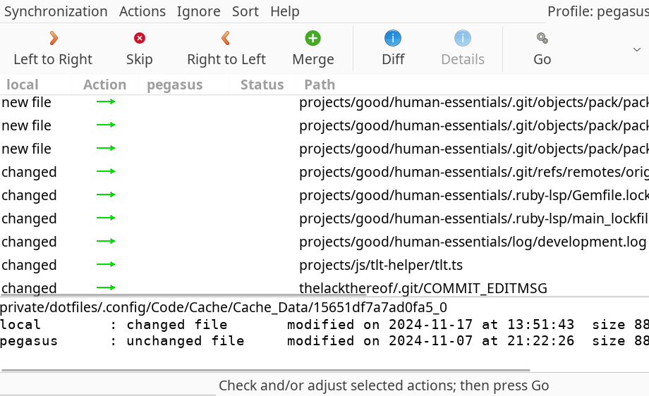

I use [Unison File Synchronizer](https://github.com/bcpierce00/unison) to keep my important files synchronized between machines. This is a description of how I have it arranged and automated. I have been using this setup since 2006!



## Directory Setup

I put all my important files into a directory called 'tlt' in my home directory. This happens to exactly correspond with the root http directory of [https://thelackthereof.org/ my website]. Most things in the directory are fine to be on the web, but things that shouldn't be published are locked through file permissions and .htaccess files. I put this 'tlt' directory into my home directory:

* /home/awwaiid/
  * tlt/ - my main directory, and the root of my website
    * private/ - holds private files
      * mail/ - holds my mail
      * dotfiles/ - holds my homedir .config files
    * projects/ - all my own code projects
    * docs/ - Various documents

I then symlink a few key directories and files from my home directory into this folder. So, for example:

* /home/awwaiid/mail -> /home/awwaiid/tlt/private/mail
* /home/awwaiid/.muttrc -> /home/awwaiid/tlt/private/dotfiles/.muttrc
* /home/awwaiid/projects/ -> /home/awwaiid/tlt/projects/

And so on. So to get all my settings from one machine to another, I just need to get a copy of this 'tlt' directory and make a few key symlinks. When I get a new machine I actually do these from my home directory. Yes, they give some error about not duplicationg `.` or `..` but ... I ignore those errors :)
* `ln -s tlt/dotfiles/.* ./`
* `ln -s tlt/private/dotfiles/.* ./`
* `ln -s tlt/projects/ .`
* `ln -s tlt/docs/ .`

I guess technically I could mash those into one big `ln -s`. Eh.

To backup all my stuff I must back up this tlt directory. This is where unison comes in.

## Unison

Unison is kinda like rsync, except smarter (stateful). It keeps a database on each machine so that it can remember what the directories looked like during the most recent synchronization. So if you delete a file on one machine it knows, and if you delete it on one machine and modify it on another it can tell that there is a conflict which you must resolve by hand. It does this through presence, timestamps, and file checksums. After you've synchronized two hosts, resolving all conflicts, you have an identical set of files on each host. We use the notation host1->host2 meaning a synchronization between host1 and host2 initiated from host1.

I have three machines on which I want an up-to-date copy of 'tlt'. They are my own computer (Feline), my website host (Mirabel), and my laptop (Jill). Generally I will sync Feline->Mirabel and Jill->Mirabel, but I could do other combinations (and often do Jill->Feline).

Let's say I am using Feline and want to sync with Mirabel. If you simply run 'unison' it will interactively prompt you for the local and remote directory you wish to synchronize, and step you through the initial sync. It'll remember too, and when you re-run it will sync what it can and ask you about conflicts. Try it a couple times, it's fun.

It stores its settings in preference files inside of ~/.unison/. Here is the preference file I use (2024) for vorm->pegasus. Really the only tricky thing is the ignore paths, which I add to every now and then.

```
# Unison preferences file

# Let's compress our SSH connection
rshargs = -C
times = true
log = false

# And these are the standard home dir locations
root = /home/awwaiid/tlt/
root = ssh://awwaiid@pegasus//home/awwaiid/tlt
servercmd = /home/awwaiid/bin/unison
# servercmd = /usr/bin/unison

# Paths to ignore -- store local-only info
ignore = Path dev
ignore = Path tmp
ignore = Path {docs/dotfiles/.urxvt/urxvtd-vorm}
ignore = Path {docs/dotfiles/.urxvt/urxvtd-zokei}
ignore = Path {docs/dotfiles/.vim/.netrwhist}
ignore = Path {docs/dotfiles/.xmonad/xmonad-x86_64-linux}
ignore = Path {docs/dotfiles/.xmonad/xmonad.hi}
ignore = Path {docs/dotfiles/.xmonad/xmonad.o}
ignore = Path {docs/tmp}
ignore = Path {private/dotfiles/.config/GIMP}
ignore = Path {private/dotfiles/.config/Signal/logs/app.log}
ignore = Path {private/dotfiles/.config/Slack}
ignore = Path {private/dotfiles/.config/bak}
ignore = Path {private/dotfiles/.config/chromium}
ignore = Path {private/dotfiles/.config/coc}
ignore = Path {private/dotfiles/.config/copyq/.copyq_s}
ignore = Path {private/dotfiles/.config/google-chrome}
ignore = Path {private/dotfiles/.config/libreoffice}
ignore = Path {private/dotfiles/.config/pianobar/ctl}
ignore = Path {private/dotfiles/.config/unity3d}
ignore = Path {private/dotfiles/.config/yarn}
ignore = Path {projects/rust/iwt/target}
```

## Automatic backups

OK, here's another tip -- most of the time there aren't any conflicts. So there is a flag for unison which lets it run in batch mode. Guess what it is?

```
awwaiid@feline:~$ unison -batch mirabel
```

This runs unison, from feline to mirabel, syncing my 'tlt' directory on each and skipping any conflicts and giving a report. This is exactly what we need for cron! Here is my entry in my own crontab on feline, along with some stuff to send me shorter email reports:

```
10 3 * * * unison -batch -terse -contactquietly mirabel 2>&1
```

Every now and then I will run unison without the -batch flag to make resolve any outstanding conflicts. A conflict might happen if I edit a file on my laptop (jill) and on my desktop (feline) without bothering to synchronize inbetween. Resolution mode will let me see a diff and select which one I want to keep (or run a merge tool or whatever I like).

I tend to sync Jill by hand. Actually I have two other machines which automatically get synced, but that is just more of the same.

## Fancier Setup

The above requires you to check, every now and then, if everything worked. You do that by looking at the log file in /tmp and maybe noticing that something isn't working. That doesn't seem like the GREATEST way to do it. So I made this wrapper that will let me know that it worked or failed:

```
#!/bin/bash

export DISPLAY=:0

/home/awwaiid/bin/unison -ui text -retry 3 -batch pegasus >/tmp/unison-pegasus.log 2>&1
command_status=$?

if [ $command_status -eq 0 ]; then
  notify-send -i emblem-synchronizing -u low 'Backup complete!'
else
  notify-send -i emblem-synchronizing -u critical 'BACKUP ERROR! SEE LOG!'
fi
```

And now my cronjob looks like this, running hourly:
```
0 * * * * /home/awwaiid/bin/unison-backup > /tmp/unison-backup.log 2>&1
```

This is a bit more specific to my system, since I have notificiations all set up with notify-send and it can work from a cronjob and all that. I suspect I'm going to have to add another escape for when the machine is offline.
