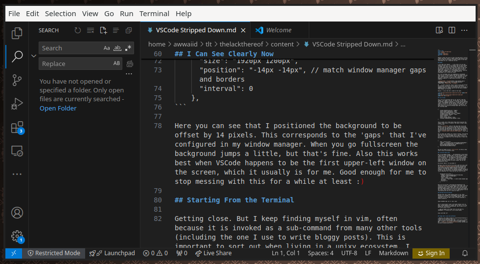
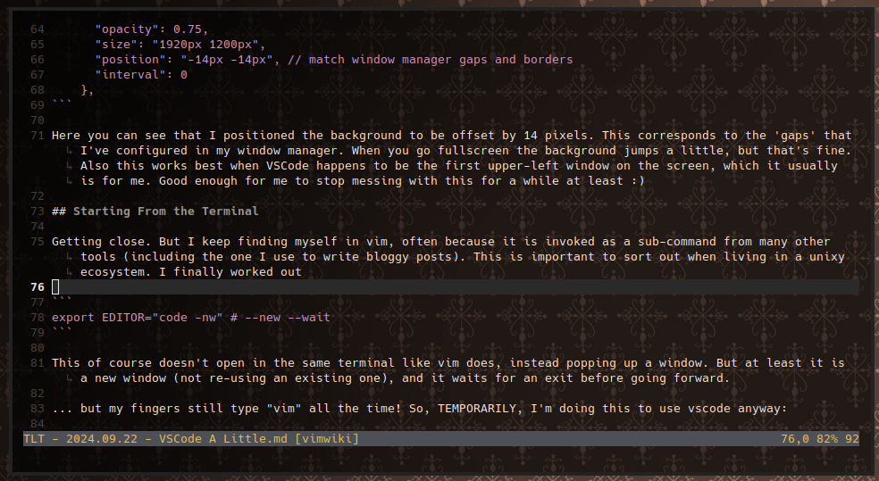
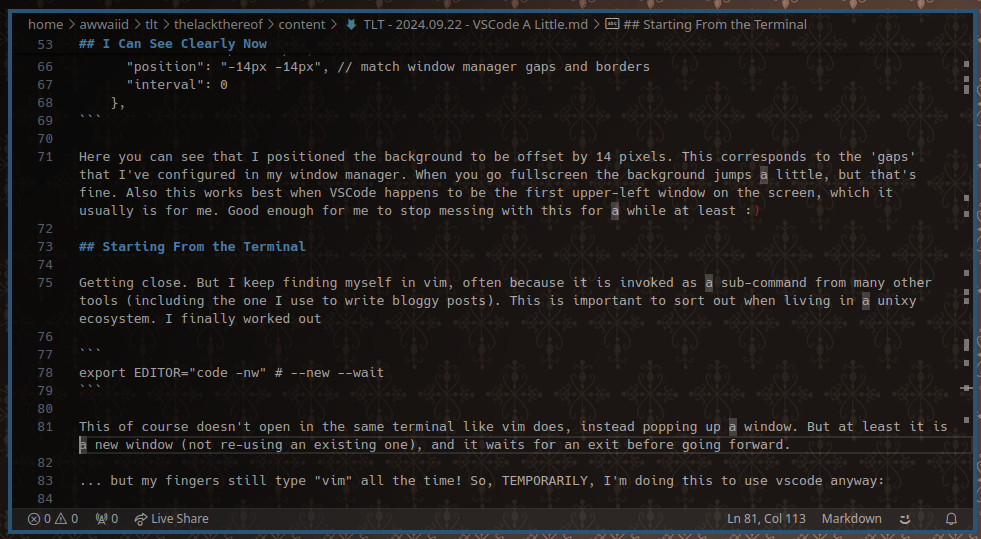

VSCode is quite cool and I'd like to be good with it, but my fingers and brain refuse to adapt without some explicit work. Here are some of the things I'm doing to make it a bit more comfortable for me, a long-time vim user.

## VSCode

I love (Neo) Vim! However ... I also like to try out new things and there are a lot of plugins that are only offered (or better supported) in VSCode, such as [Cody](https://sourcegraph.com/cody). Also there are some things that an editor with full GUI capabilities can do that aren't quite so easy from the terminal. On top of that, there are plenty of fans of VSCode that I work with on a daily basis and I'd like to speak their language. VSCode is a programmable editor, like Vim and Emacs and other greats, and a good choice for programming. Let's stretch our brain!

So I fire up VSCode! And I am *immediately* overwhelmed. Here is roughly what I see:



There are all of these sidebars and tabs and header bars and other sidebars and all sorts of things! Everything is loud and I don't know what to look at. Also, obviously, the keyboard navigation is significantly different. I need to simplify. I want to strip this down to the bone. Then I can build it up again later.

[](https://www.youtube.com/watch?v=qU8UfYdKHvs "Depeche Mode - Stripped")

OK ... so here's the plan. First I want to remove everything from the UI but the basics. A lot of the visual elements such as the tab bar can be replaced with keyboard navigation. Hence, second I'll mostly *learn* the default keyboard shortcuts. Maybe I'll eventually pull in vim-mode or embedded-neovim, but people seem to use this editor without those things, so I can too.

Results -- vim on the left, vscode on the right:




## Trim It Down

Let's turn off everything that we can. We don't need the sidebar, the sidebar icon bar, the top menu, the top tabs, the minimap, indention indicator, or the max-column indicator (ruler). The embedded terminal doesn't need tabs either (I'd rather it be split or can use the menu or other keys). Also while we're at it I'll turn on word-wrap. Here is what it looks like by default:

I turned all of those things off using the settings editor GUI, but here is the resulting JSON:

```json
{
    "window.menuBarVisibility": "toggle",
    "editor.guides.indentation": false,
    "editor.overviewRulerBorder": false,
    "workbench.activityBar.location": "hidden",
    "workbench.editor.showTabs": "none",
    "editor.wordWrap": "on",
    "editor.rulers": [],
    "editor.minimap.enabled": false,
    "terminal.integrated.tabs.enabled": false,
}
```

This is great, but I keep doing things that bring back the sidebar! Great while i'm using it, but when I'm done I want it to go away.

Running `ctrl+shift+p` gives us the super menu of all the things we can do. If you find a thing that has keybindings, you can press the keybinding next time. Good way to discover new shortcuts and new actions. I want to hide the sidebar and maximize the edit screen, and the command for that on the list is `Maximize Editor Group and Hide Sidebars`. Great! Jam that.

Now we *want* the sidebar for a bunch of things, like messing with the file-tree or extension lists or git stuff or bot chat. Once I've used the sidebar and I'm done, I want it to go away. So I've added this to my keybindings.json to make this even easier:

```json
{
    "key": "ctrl+k ctrl+k",
    "command": "workbench.action.maximizeEditorHideSidebar",
    "when": "auxiliaryBarVisible || sideBarVisible || editorPartMultipleEditorGroups && !editorPartMaximizedEditorGroup",
}
```

And now my fingers can hit `ctrl+k ctrl+k` as often as they like to focus on the editor alone.

## I Can See Clearly Now

One of the dumbest things .... the background is solid black. I have this silly wallpaper that I can see through all of my terminal windows, and I'm used to it being there. I looked into transparency for the background, and possibly because I live in Linux-land (Wayland/Sway) ... no workey. I tried a few different plugins and CSS overrides and so on.

No worries! Fake it 'til you make it!

Pulling a very old trick out of my hat, what we'll do is get the [Background (shalldie) extension](https://marketplace.visualstudio.com/items?itemName=shalldie.background), and then set the background image in VSCode to an image that *happens* to be the same as the desktop wallpaper. We used to do this all the time before we invented transparent terminals (which themselves for a long time did the trick for you).

```json
    "background.fullscreen": {
      "images": ["file:///home/awwaiid/tlt/docs/bg/wallpaper-41040-1920x1080.png"],
      "opacity": 0.75,
      "size": "1920px 1200px",
      "position": "-14px -14px", // match window manager gaps and borders
      "interval": 0
    },
```

Here you can see that I positioned the background to be offset by 14 pixels. This corresponds to the 'gaps' that I've configured in my window manager. When you go fullscreen the background jumps a little, but that's fine. Also this works best when VSCode happens to be the first upper-left window on the screen, which it usually is for me. Good enough for me to stop messing with this for a while at least :)

... that said, this still isn't right. It is actually making the whole UI a little transparent, which dulls the fonts. I haven't figured out how to set the background image without affecting the rest of the UI.

## Starting From the Terminal

Getting close. But I keep finding myself in vim, often because it is invoked as a sub-command from many other tools (including the one I use to write bloggy posts). This is important to sort out when living in a unixy ecosystem. I finally worked out

```sh
export EDITOR="code -nw" # --new --wait
```

This of course doesn't open in the same terminal like vim does, instead popping up a window. But at least it is a new window (not re-using an existing one), and it waits for an exit before going forward.

... but my fingers still type "vim" all the time! So, TEMPORARILY, I'm doing this to use vscode anyway:

```sh
alias vim="code -nw"
```

## Things that I wish were different

* Opening a new window instead of inline-terminal-editing is jarring, but I'm getting used to it
* When I do have multiple panes open I would love to pretend these are more or less windows like my in window manager. BUT ... [there is no focus-follows-mouse](https://github.com/microsoft/vscode/issues/93772)!
* This transparent background not being quite right is still bothering me